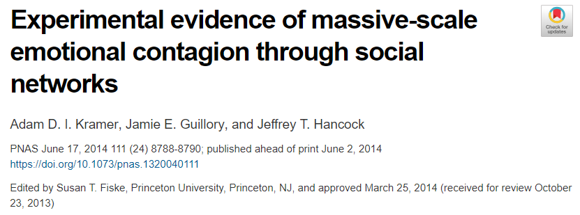

```{r setup, include = FALSE}
options(htmltools.dir.version = FALSE,
        dplyr.summarise.inform = FALSE)
xaringanExtra::use_webcam()
xaringanExtra::use_tile_view()
xaringanExtra::use_extra_styles()
xaringanExtra::use_panelset()
knitr::opts_chunk$set(fig.asp = .618,
                      fig.width = 6,
                      warning = FALSE)
library(xaringanthemer)
style_solarized_light(base_font_size = "22px")
library(tidyverse)
library(afex)
options(scipen = 999)
```

class: center, middle, inverse
# Replicability and reproducibility in psychology

---
background-image: url(images/headlines-repro.png)

---
background-image: url(images/F1.large.jpg)
background-size: contain

---
class: center, middle, inverse
# Null Hypothesis Significance Testing (again)

---
# Setting up our studies

When we embark on a programme on research, we begin by identifying a **research question**.

- Do people who have been a victim of crime express higher fear of crime?

- Are people faster at saying the names of colours when the names are written in the same colour?

---
# Null Hypothesis Significance Testing (NHST) (again)

Our typical way of answering questions such as these is to set up a Null Hypothesis as an alternative. 

Typically, this hypothesis is that of **zero** effect. 

We then pose the question:

If there were no difference or relationship between these two variables in the population, how likely is it that we would observe this data in our sample?

---
# The process of NHST

```{r}
a <- rnorm(50)
b <- rnorm(50, mean = 1)
t.test(a, b)
```


---
class: center, inverse, middle
# Interpreting p-values

---
# Significance versus non-signifiance

In our field, we typically set our significance criterion - *alpha*, or $\alpha$ - at .05.

If the p-value of our test falls **below** this threshold, we say we have a *significant* result, and we get all excited and break out the bubbly. 
`r paste(rep(emo::ji("champagne"), 3))`

If the p-value falls **above** this threshold, we say we have a *non-significant* result, and we get extremely upset.
`r  paste(emo::ji("disappointed"), emo::ji("sob"), emo::ji("disappointed"))`

--

(both these reactions are a little bit over-the-top)

---
# Type I and Type II errors

Under NHST, we are trying to decide whether our statistical results match reality. There are **two** basic types of error we can make. 

|         | Null hypothesis is false| Null hypothesis is true|
|-        |   :-------------:       |  :---------------:     |
|p <= .05 |True positive            | False positive         |
|p > .05  |False negative           | True negative          |

*False positives* - a significant result when there is *no* real effect - are called **Type I errors**.

*False negatives* - a non-significant result when there *is* a real effect - are called **Type II errors**.

---
# The false-positive rate

When the null hypothesis is **true**, *any specific p-value is as likely as any other*.

So if the null hypothesis is *true*, and there is *no* real effect, we will get a **significant result** 5% of the time - **1 in every 20** repeats.

In other words, setting $\alpha$ at .05 means we accept a **false positive rate** of 5%.

---
# The false-positive rate

.pull-left[
```{r echo = FALSE, message = FALSE, fig.height=5}
normsim <- function(n = 100,
                    mean = 0,
                    sd = 1) {
  run_test <- t.test(rnorm(n, mean, sd))
  run_test$p.value
}

zz <- replicate(1000, normsim())

ggplot() + 
  geom_histogram(aes(zz),
                 fill = "white",
                 colour = "black",
                 binwidth = 0.05,
                 boundary = 0) +
  geom_vline(xintercept = 0.05,
             linetype = "dashed",
             colour = "red") + 
  labs(x = "P-value",
       y = "Number of tests") +
  theme(text = element_text(size = 20))
```
]

.pull-right[
Here, I simulated *normally distributed* data from 100 participants with a mean of zero, one thousand times.

Each time, I tested whether that data was significantly different from zero.

Approx 5% of the p-values of these 1000 tests were < .05.
]

---
# The false-negative rate

When the null hypothesis is false, p-values lower than our threshold become *more likely*. But it's still not certain we'll get a *significant effect*. 
.pull-left[
```{r echo = FALSE, message = FALSE, fig.height=5}
zz <- replicate(1000, normsim(mean = .15))

ggplot() + 
  geom_histogram(aes(zz),
                 fill = "white",
                 colour = "black",
                 binwidth = 0.05,
                 boundary = 0) +
  geom_vline(xintercept = 0.05,
             linetype = "dashed",
             colour = "red") + 
  labs(x = "P-value",
       y = "Number of tests") +
  theme(text = element_text(size = 20))
```
]
.pull-right[
Here, I simulated data from 100 participants with a mean of 0.15, 1000 times, each time  testing whether the data differs from zero.

Approx 320 tests out of 1000 were significant - a true-positive rate of .32, and a false-negative rate of .68 - 68%.
]

---
# What does the p-value tell us?

Does a significant p-value tell us how likely it is our experimental hypothesis - that there is really an effect - is *true*?

--

.pull-left[

]

.pull-right[
1) Even if there was an effect, it may not be for the reason we think. 

2) A significant finding may also be a **false positive**.
]

---
# What does the p-value tell us?

Does a non-significant p-value tell us that there is no effect, or that our hypothesis was false?

--

.pull-left[

]
.pull-right[
1) A non-significant effect only tells us that we **failed to reject** the null hypothesis.

2) A non-significant effect can be a **false negative**.
]

---
# Ok, does the p-value tell us how **big** the effect is?

--

.pull-left[

]
.pull-right[
P-values tell us *absolutely nothing* about the size of the effect.

All they tell us that the data is *unlikely* if the null hypothesis is true, not whether the effect is large or small. Tiny effects can have p-values just as tiny as large effects can.

]

---
# Right. So does it tell us how **important** the effect is?

--
.pull-left[

]
.pull-right[
A tiny p-value does not mean the effect is any way *important*.

Essentially meaningless effects can have very small p-values.
]


---
class: inverse, center, middle
# So what *does* the p-value tell us?

---
background-image: url('images/drakememe.jpg')


---
class: inverse, middle, center
# Effect sizes

---
# Effect sizes

*p-values* tell us how likely it was that the data we observed would happen if the null hypothesis were true. But to understand what our tests are really telling us, we need to look at *effect sizes*.

Effect sizes:

1) Communicate the practical significance of a result.

2) Enable comparison across different studies and different scales.

3) Allow you to perform *power analysis*.

---
# Unstandardized effect sizes

Unstandardized effect sizes are effects on the *measurement scale*.

.pull-left[
Easy to understand and interpret, so they're particularly helpful for understanding the real-world relevance of statistical effects.

e.g. Usain Bolt ran .12 seconds faster than Yohan Blake.
]
.pull-right[

]

---
# Standardized effect sizes

Standardized effect sizes place effects on a common scale - they're helpful when the dependent measure is measured in different units across different studies.

|1|2|3|4|5|
|----|----|||
|Definitely agree| Somewhat agree | Neither agree nor disagree | Somewhat disagree | Definitely disagree |

----

|1|2|3|4|5| 6| 7| 
|----|----|||
|Definitely agree| Somewhat agree | Slightly agree| Neither agree nor disagree | Slightly disagree| Somewhat disagree | Definitely disagree |

---
# Standardized effect sizes

There are two major families of standardized effect size:

|Measure|*Cohen's d*|*r*|
|-|---|---|
|**Definition**| Size of mean differences| Strength of association |
|**Statistical tests**|t-tests|correlation, ANOVA, regression|
|**Variations**| $d$, $d_z$, Hedge's $g$ | $r$, $r^2$, $\eta^2$, $\omega^2$|

---
class: inverse, center, middle
# Standardized mean differences

---
# Cohen's d

Cohen's *d* ranges from 0 to $\infty$ (infinity!)

The basic calculation is pretty simple - it's the *mean difference* divided by the *standard deviation pooled across conditions*.

$$ \frac{\mu_1 - \mu_2}{ SDpooled } $$

All variations of Cohen's *d* for different types of design (e.g. $d_z$ for within-subjects designs) are variants of this formula.

---
#Interpreting Cohen's d

The website linked here provides a great interactive tool to visualize what Cohen's *d* is
[RPsychologist Cohen's d](https://rpsychologist.com/d3/cohend/)

---
# Pooled standard deviation

The pooled standard deviation is calculated using this formula:

$$ SD_{pooled} = \sqrt\frac{SD^2_1 + SD^2_2}{2} $$

```{r}
sqrt((sd(a)^2 + sd(b)^2) / 2)
```

---
# Quick example

```{r}
t.test(a, b)

(mean(a) - mean(b)) / sqrt((sd(a)^2 + sd(b)^2) / 2)
```

---
# The `effectsize` package

A simpler way to calculate Cohen's *d* is to use the `cohens_d` function from the `effectsize` package.

```{r}
library(effectsize)
cohens_d(a, b)
```

This also gives us *confidence intervals* around the effect size - a helpful reminder that these are *estimates*.

---
# The Facebook study

---
# The Facebook study


---
# The Facebook study


.large[
P = .007, *d* = .001. This is an absolutely **tiny** effect size.

Approx 1 extra negative word for every 3570 words typed.

```{r}
effectsize::interpret_d(.001)
```
]

---
class: inverse, center, middle
# Strength of associations

---
# Guess the correlation

.pull-left[
```{r echo = FALSE, fig.height = 5}
corr_dat <- MASS::mvrnorm(n = 100,
                     rep(0, 2),
                     Sigma = matrix(c(1, 0.2, 0.2, 1), ncol = 2),
                     empirical = TRUE)
qplot(corr_dat[, 1], corr_dat[, 2]) 
```
]

--

.pull-right[
.large[
*r* = .2
```{r}
interpret_r(.2)
```
]
]

---
# Guess the correlation

.pull-left[
```{r echo = FALSE, fig.height = 5}
corr_dat <- MASS::mvrnorm(n = 100,
                     rep(0, 2),
                     Sigma = matrix(c(1, 0.8, 0.8, 1), ncol = 2),
                     empirical = TRUE)
qplot(corr_dat[, 1], corr_dat[, 2]) 
```
]

--

.pull-right[
.large[
*r* = .8
```{r}
interpret_r(.8)
```
]
]


---
# Guess the correlation

RPsychologist correlation visualizations
[https://rpsychologist.com/d3/correlation/](https://rpsychologist.com/d3/correlation/)

[guessthecorrelation.com](http://guessthecorrelation.com)

---
# Converting from r to d

Although the scale is different, *r* and *d* are closely related.

The formula below can be used to convert between them.

$$ r = \frac{d}{\sqrt{d^2_s + \frac{N^2 - 2N}{n_1n_2}}}$$
```{r}
r_to_d(.8) # from the effectsize package again!
interpret_d(r_to_d(.8))
```

---
# Proportion of variance explained

For regressions, and ANOVAs, we don't use the correlation coefficient on its own. Rather, we use one of the various *proportion of variance explained* effect sizes.

|Symbol | name|
|---- |---- |
| $r^2$ | r-squared |
| $\eta^2$ | eta-squared|
| $\eta^2_p$ | partial eta-squared|
| $\eta^2_g$ | generalized eta-squared|

---
# Proportion of variance explained

Every one of these measures is a variation on the same thing: how much does the relationship between our variables reduce the error of our model.

Remember the formula for R-squared ( $r^2$)? 

$r^2 = \frac{SS_m}{SS_t}$

It's the ratio of the variance explained by the model to the total variance in the model. Thus, it's the *percentage of variance explained by the model*. 

---
class: center, middle, inverse
# Reporting effect sizes in your results

---
# Reporting effect sizes in your results

When reporting your statistical results, it's best practice (though not always followed...) to report both standardized **and** unstandardized effect sizes.

1) Reporting **unstandardized** effect sizes helps understand how big the effect is in *real terms*. 

2) Reporting **standardized** effect sizes helps compare the effect to effects in different studies and on different scales.

3) Always interpret the effect sizes. Take care of the difference between *statistical* and *practical* significance.

4) Many of the standardized effect sizes are somewhat *interchangeable*, but always try to report the right one for your test (e.g. Cohen's d for t-tests, $r^2$ / $adjusted-r^2$ for regression)

---
# Which standardized effect should you report?

|Statistical test| Standardized effect size|
|---||
| t-test| $d$ (between), $d_z$ (within), $d_s$|
| ANOVA | $\eta^2$ (one-way), $\eta^2_p$ (factorial), $\eta^2_g$ (Any)|
| Correlation | $r$|
| Linear (simple or multiple) regression | $r^2$, $adjusted-r^2$|

Note - not every possible test and every possible effect size can fit! We'll cover some more later in the course...

---
# Rules of thumb for interpreting standardized effect sizes

|Effect size|small|medium| large|
|-|-|-|-|
|d|0.2|0.5|0.8|
|r|.1|.3|.5|
| $r^2$|.1|.19|.25|
| $\eta^2$ |.01|.06|.14|
| $\eta^2_p$ |.01|.09| .25|
| $\eta^2_g$ |.02|.13|.26|

These are *guidelines*, not *rules*. (you can also try the `interpret` functions from `effectsize`)

---
class: inverse, center, middle
# Designing for statistical power

---
# Statistical power

Statistical power is the inverse of the **false-negative rate**. 

Also termed *beta*, or $\beta$, power is the probability of getting a significant result with a given *sample size*, *statistical test*, and *effect size*. 

By convention, psychological studies aim for **80% power** - we accept a 20% false-negative rate!


???
Cohen, J. (1992). A power primer. Psychological Bulletin. 112(1):155-9. doi: 10.1037//0033-2909.112.1.155.

---
# Statistical power and sample size

Sample size is an important factor determining statistical power:

.pull-left[
```{r echo = FALSE}
sample_sizes <- seq(20, 700, by = 40)
pvals <- purrr::map(sample_sizes,
                    ~replicate(1000, normsim(n = ., mean = 0.1)))
names(pvals) <- sample_sizes
pvals <- bind_rows(pvals) 
pvals %>%
  gather(mean, p.vals) %>%
  mutate(p.vals = 0 + (p.vals < .05)) %>%
  ggplot(aes(x = as.numeric(mean), y = p.vals)) +
  stat_summary(fun.data = mean_cl_boot) +
  stat_summary(geom = "line",
               fun = mean,
               group = 1) +
  theme_bw() +
  theme(text = element_text(size = 22))+
  labs(x = "Sample size (N)",
       y = "Proportion of significant tests")
```
]
.pull-right[
Here I simulate the effects of **increasing sample size** on statistical power.

The **effect size** stays constant - there's a 0.1 difference between the means of each group.
]

---
# Estimating sample size

We can estimate the *required sample size* of a specific statistical test if we know the desired *power* and the *expected effect size*. The hardest part of this is typically **knowing what effect size you expect**.

```{r}
library(pwr)
pwr.t.test(power = .8, # this is a proportion
           d = .3, # Cohen's d
           type = "one.sample") # we are doing a one-sample t.test
```

---
# Why don't we aim for 100% power?

```{r}
pwr.t.test(power = 1, # this is a proportion
           d = .3, # Cohen's d
           type = "one.sample") # we are doing a one-sample t.test
```

100% power is often *just a little* impractical.

---
# Estimating effect size

We can estimate the *effect size we'd have power to detect* if we know the *power* and the *sample size*. Suppose we *know* we'd have 100 participants - we can't get more, and we won't get [fewer](https://imgur.com/gallery/d3dQm6V).

```{r}
pwr.t.test(power = .8, # this is a proportion
           n = 100, # Cohen's d
           type = "one.sample") # we are doing a one-sample t.test
```

---
# Statistical power and effect size

.pull-left[
```{r echo = FALSE, message = FALSE, fig.height=5}
zz <- replicate(1000, normsim(mean = .283))

ggplot() + 
  geom_histogram(aes(zz),
                 fill = "white",
                 colour = "black",
                 binwidth = 0.05,
                 boundary = 0) +
  geom_vline(xintercept = 0.05,
             linetype = "dashed",
             colour = "red") + 
  labs(x = "P-value",
       y = "Number of significant tests") +
  theme(text = element_text(size = 20))
```
]

.pull-right[
Here, I simulate data with a mean of 0.283, 1000 times, and test whether it differs from zero. 

The *sample size* remains constant at 100 participants.

Approx 800 tests are significant - a true-positive rate of .80, and thus a statistical power - $\beta$ - of 80%.
]

---
# Statistical power and effect size

.pull-left[
```{r power-curve, echo = FALSE, fig.height=5}
effect_sizes <- seq(0, 0.5, by = 0.05)
pvals <- purrr::map(effect_sizes, ~replicate(1000, normsim(mean = .)))
names(pvals) <- effect_sizes
pvals <- bind_rows(pvals) 
pvals %>%
  gather(mean, p.vals) %>%
  mutate(p.vals = 0 + (p.vals < .05)) %>%
  ggplot(aes(x = mean, y = p.vals)) +
  stat_summary(fun.data = mean_cl_boot) +
  stat_summary(geom = "line", fun = mean, group = 1) +
  theme_bw() +
  theme(text = element_text(size = 20))+
  labs(x = "Difference of mean from 0",
       y = "Proportion of significant tests")
```
]
.pull-right[
In this simulation, the general design of the study stays the same - there are 100 participants, we test against zero with a t-test.

As the effect size increases, the **power** of the study increases.
]

---
# Statistical power and effect sizes

.pull-left[
```{r echo = FALSE, fig.height=5}
mean_pvals <- pvals %>%
  gather(mean, p.vals) %>%
  mutate(p.vals = 0 + (p.vals < .05)) %>%
  group_by(mean) %>%
  summarise(p.vals = mean(p.vals))

pvals %>%
  gather(mean, p.vals) %>%
  mutate(p.vals = 0 + (p.vals < .05)) %>%
  ggplot(aes(x = as.numeric(mean), y = p.vals)) +
  stat_summary(fun.data = mean_cl_boot) +
  stat_summary(geom = "line", fun = mean, group = 1) +
  theme_bw() +
  theme(text = element_text(size = 20)) +
  labs(x = "Difference of mean from 0",
       y = "Proportion of significant tests") + 
  geom_vline(xintercept = 0.1, linetype = "dashed") +
  geom_hline(yintercept = mean_pvals[3, 2, drop = TRUE], linetype = "dashed") +
  geom_vline(xintercept = 0.3, linetype = "dotted") +
  geom_hline(yintercept = mean_pvals[7, 2, drop = TRUE], linetype = "dotted")
```
]
.pull-right[
The study has approximately `r mean_pvals[3, 2, drop = TRUE] * 100`% power to detect a 0.1 difference in means.

But the study also has approximately `r mean_pvals[7, 2, drop = TRUE] * 100`% power to detect a 0.3 difference in means.

Studies have a **power curve**, not a single *power*.
]

---
# Estimating power

We can estimate the *power* of a specific statistical test if we know the *sample size* and the *effect size*. 

```{r}
pwr.t.test(n = 100, # this is a proportion
           d = .3, # Cohen's d
           type = "one.sample") # we are doing a one-sample t.test
```

... but this is not generally what you want to do. After you've done the study, it's too late. Before you run the study, you want to estimate sample size to know how many people you need.

---
# Critiquing the statistical power of a study

A common critique of studies is that their sample size is **too low**, and thus that they lack statistical power.

But any given study always has 80% power to detect **something**: power is a **curve**.

A better critique is that a study has insufficient sample size to reliably detect a **meaningful, important effect**.

---
# Further (suggested, not required) reading

Lakens, D. (2013). Calculating and reporting effect sizes to facilitate cumulative science: a practical primer for t-tests and ANOVAs. Frontiers in Psychology. https://www.frontiersin.org/articles/10.3389/fpsyg.2013.00863/full

Perugini, M., Gallucci, M., & Costantini, G. (2018). A Practical Primer To Power Analysis for Simple Experimental Designs. International Review of Social Psychology, 31(1), 20. DOI: http://doi.org/10.5334/irsp.181

---
# Next session

We'll be skipping two weeks for **Easter!**.

The following week, we'll be returning to **Multiple regression** and looking at **logistic regression and Generalized linear models.**.

Chapter 8 of Field et al, Discovering Statistics Using R.
