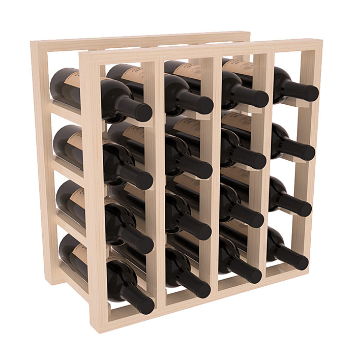

```{r setup, include=FALSE}
options(htmltools.dir.version = FALSE)
xaringanExtra::use_webcam()
xaringanExtra::use_tile_view()
xaringanExtra::use_tachyons()
xaringanExtra::use_extra_styles()
options(htmltools.dir.version = FALSE)
knitr::opts_chunk$set(fig.asp = .618,
                      fig.width = 6)
library(tidyverse)
FearofCrime <- read_csv("data/FearofCrime.CSV")
```
```{r xaringantheme, include = FALSE, warning = FALSE}
library(xaringanthemer)
style_mono_light(base_color = "#23395b",
                 base_font_size = "21px",
                 link_color = "#C80039")
```

```{r echo = FALSE, message = FALSE}
example_rt_df <- 
  data.frame(Participant = rep(1:10,
                               each = 10),
             Viewpoint = c("Same", "Different"),
             B1RT = rnorm(20, 500, 100),
             B2RT = rnorm(20, 400, 100)) %>%
  group_by(Participant, Viewpoint) %>%
  summarise(B1RT = mean(B1RT),
            B2RT = mean(B2RT))
```

# Writing R Scripts

Scripts are text documents that contain a sequence of commands to be executed sequentially.

A typical script looks something like this:
```{r eval = FALSE}
# Load in required packages using library()
library(tidyverse)

# Define any custom functions here (we haven't covered this!)

# Now load any data you want to work on. (again, we'll cover this later!)
test_data <- 
  read_csv("data/a-random-RT-file.csv") %>% # I'll explain what %>% means later
  rename(RT = `reaction times`)

# The rest of the script then runs whatever analyses or plotting you want to do
ggplot(test_data,
       aes(x = RT,
           fill = viewpoint)) + 
  geom_density()
```

---
background-image: url(images/02/cloud-rmd-example.png)
background-position: 65% 85% 
background-size: 46%
# RMarkdown

.large[
RMarkdown documents contain a mixture of code and plain text.

They can be used to produce *reports* and fully formatted documents with whatever structure you choose.
]

---
# Basic data types

There are five basic data types in R:

```{r echo=FALSE}
examps <- data.frame(Type = c("integer", "numeric",
                              "character", "logical",
                              "complex"),
           Description = c("Whole numbers",
                           "Any real number, fractions",
                           "Text",
                           "Assertion of truth/falsity",
                           "Real and imaginary numbers"),
           Examples = c( "1, 2, 3",
                         "3.4, 2, -2.3",
                         "\"Hi there\", \"8.5\", \"ABC123\"",
                         "TRUE, FALSE",
                         complex(real =.34, imaginary = 5.3)))
knitr::kable(examps, format = "html")
```

---
# Containers

**Vectors** are one-dimensional collections of values of the same basic data type.

**Matrices** are two-dimensional collections of values of the same basic data type.

**Lists** are collections of objects of varying length and type.

**Data frames** are tables of data.

.pull-left[

]
.pull-right[

]

---
# Accessing elements from containers

You can use the **[]** operator after the name of an object to extract indvidual elements from that object.

```{r echo = FALSE}
album_list <-
  list(The_Beatles = c(
    "Sgt. Pepper",
    "The White Album",
    "Revolver",
    "Abbey Road"),
    Nirvana = c(
      "Bleach",
      "Nevermind",
      "In Utero")
    )
test_matrix <- matrix(rnorm(9), nrow = 3, ncol = 3)
char_example <- c("Monday", "Tuesday", "Wednesday", "Thursday")
one_to_four <- 1:4
names(one_to_four) <- char_example
```
.pull-left[
```{r}
one_to_four
test_matrix
```
]
.pull-right[
```{r}
one_to_four["Wednesday"]
test_matrix[2:3, 1:2]
```
]

---
background-image: url(images/03/tidy-hex.png)
background-position: 50% 75%
background-size: 50%
class: inverse, middle, center

---
background-image: url(images/03/tidy-hex.png)
background-position: 90% 5%
background-size: 8%

# Tidyverse 

.large[
The **tidyverse** is a collection of packages that expand R's functions in a structured, coherent way.

```{r eval = FALSE}
install.packages("tidyverse")
```
]
.large[
There are eight core **tidyverse** packages loaded using **library(tidyverse)**.

.pull-left[
* ggplot2
* **tidyr**
* dplyr
* **tibble**
]
.pull-right[
* purrr
* readr
* stringr
* forcats
]
]

---
background-image: url(images/03/tidy-hex.png)
background-position: 90% 5%
background-size: 8%

# Tidyverse

.large[
You can load all these packages at once.
]

```{r eval = FALSE}
library(tidyverse) # This loads all the tidyverse packages at once
```

.large[
You can also load each one individually. We'll be using the **tibble** package next.
]

```{r eval = FALSE}
library(tibble)
```

.large[Many of the *tidyverse* packages create or output *tibbles*, which are essentially a more user-friendly version of data frames.]

---
# Tibbles

You can create a *tibble* similar to how you create a data frame, using **tibble()**.

```{r}
age_tibb <- 
  tibble(Participant = 1:10, 
         cond1 = rnorm(10),
         age_group = rep(c("Old", "Young"),
                         each = 5))
head(age_tibb)
```

---
# Tibbles
```{r eval = FALSE}
age_tibb <- 
  tibble(Participant = 1:10, 
         cond1 = rnorm(10),
*        age_group = rep(c("Old", "Young"), each = 5))
```

Here I used the **rep()** function to generate a character vector with the values "Old" and "Young".

```{r}
rep(c("Old", "Young"), each = 5)
rep(c("Old", "Young"), 5)
```

---
class: middle, center, inverse
# Importing data into R

---
# Different types of file

Data comes in many different shapes, sizes, and formats.

The most common file formats you'll deal with are either Excel files or text files, but you may also find dealing with SPSS files useful.

Fortunately, R has several functions and packages for importing data!

|File formats| File extension| Functions| Package|
|-|-|-|-|
|SPSS  | .sav| **read_sav()**| library(haven)|
|Excel | .xls, .xlsx|**read_excel()**|library(readxl)|
|Text  | .csv, .txt, .* |**read_csv()**, **read_delim()**|library(readr)|


---
# Importing data into R


.pull-left[
## Comma-separated values

]
.pull-right[
## Excel spreadsheets

]


---
# Fear of Crime Dataset

.large[
[Ellis & Renouf (2018)](https://doi.org/10.1080/14789949.2017.1410562) - the relationship between fear of crime and various personality measures.

Their data is openly available, stored as text in a *comma-separated-values* format (*.csv*).

Once again, we can use the import button or some code (with **read_csv()**) to load this data in and automatically format it into a *tibble*.

```{r foc-dataset, eval = FALSE}
library(readr)
FearofCrime <- read_csv("data/FearofCrime.CSV")
```

See also [Ellis & Merdian, 2015](https://doi.org/10.3389/fpsyg.2015.01782), Frontiers in Psychology
]

---
# Fear of Crime Dataset

Ellis & Renouf (2018) collected data online using Qualtrics.

The file contains one column for each question that the participants answered, for a total of 169(!) columns.

Each row represent a single participant's responses, and their demographic information.

```{r}
FearofCrime
```

---
background-image: url(images/05/import-data-button.png)
background-size: contain
class: inverse

---
background-image: url(images/05/import-text-dialog.png)
background-size: contain
class: inverse

---
background-image: url(images/05/import-text-browse.png)
background-size: contain
class: inverse

---
background-image: url(images/05/import-text-url.png)
background-size: contain
class: inverse

---
background-image: url(images/05/import-text-code-prev.png)
background-size: contain
class: inverse

---
background-image: url(images/05/import-foc.png)
background-size: contain
class: inverse

---
class: center, middle, inverse
# Keeping your analyses organised

---
background-image: url(https://imgs.xkcd.com/comics/documents.png)
background-size: contain

???

Image from Xkcd = https://xkcd.com/1459/

---
# RStudio Projects

.large[
On [RStudio.cloud](https://rstudio.cloud), each project you create is in fact a completely separate instance of R.

By now, most of you should have [RStudio Desktop](https://www.rstudio.com/products/rstudio/download/) installed.

Once that's up and running, you can get to grips with [RStudio projects](https://support.rstudio.com/hc/en-us/articles/200526207-Using-Projects) 

Projects provide a nice way to organise your work into neat, individually tailored sets of directories.
]

---
background-image: url(images/noneproject.png)
background-size: contain

---
background-image: url(images/projectdropdown.png)
background-size: contain

---
background-image: url(images/createnew.png)
background-size: contain

---
background-image: url(images/createdemo.png)
background-size: contain

---
background-image: url(images/createnew.png)
background-size: contain

---
# Keeping your analyses organised

Make a new RStudio project for each week's exercises!

Follow sensible structure:

Keep your data in a folder called data.

Keep your scripts or RMarkdown documents in a folder called scripts.

[Give your files sensible names!](https://speakerdeck.com/jennybc/how-to-name-files)

For more general workflow advice, check out What They Forgot to Teach You About R at [https://rstats.wtf/](https://rstats.wtf/)


---
class: inverse, center, middle
# Relating data to structure

---
# Let's think about an *experiment*

.large[
The experiment is a reaction time experiment with a two-by-two repeated measures design.

Participants see pictures of objects twice. Sometimes they are seen from the *same* viewpoint twice, sometimes from *different* viewpoints each time. 

There are two separate blocks of trials. 
The dependent variable is how long it takes them to name the objects, or *reaction time*.

You're interested in whether:

1. they get faster at naming object the second time

2. they are faster when the same view is presented both times.
]

---
# How many variables are there?

|Variables| R Data Type|
|--------------|------------|
|Participant ID|Numeric or character|
|Reaction times|Numeric|
|Block first/second|Character/factor|
|Viewpoint same/different|Character/factor|

.large[
The final dataset needs to be able to do several things.

1. It needs to uniquely identify each participant.

2. It needs to tie each value to the right participant.

3. It needs to identify what each value represents in terms of the design.
]

---
class: inverse, center, middle
# Tidy data

---
background-image: url(images/03/tidy-1.png)
background-position: 50% 72%
background-size: 75%
# The three principles of tidy data

1.  Each variable must have its own column.

2.  Each observation must have its own row.

3.  Each value must have its own cell.

---
background-image: url(images/03/tidy-1.png)
background-position: 50% 85%
background-size: 70%
# Why Tidy?

.large[
1. Many functions in R operate on so-called *long* format data, requiring dependent and independent variables to be in different columns of a data frame.

2. Having a consistent way to store and structure your data makes it more *generic*. This makes it easier to use it with different functions.

3. Being *generic* also makes it easier to understand a new dataset in this format.
]

---
class: inverse, center, middle
# The many ways to structure data

---
# One column for condition, one column for RT
.pull-left[
```{r echo = FALSE, message = FALSE}
set.seed(200)
example_rt_df <- 
  data.frame(Participant = rep(1:10,
                               each = 40),
             exp_condition = rep(c("Block1_same",
                                   "Block2_same",
                                   "Block1_different",
                                   "Block2_different"),
                                 each = 10),
             RT = rnorm(400, 400, 100)) %>%
  group_by(Participant, exp_condition) %>%
  summarise(RT = mean(RT))
example_rt_df
```
]
.pull-right[
.large[
This is a little awkward.

At first glance, there's no easy way to see how many variables there.
]
]
---
# Dependent variable split across columns

.pull-left[
```{r echo = FALSE, message = FALSE}
set.seed(200)
example_rt_df <- 
  data.frame(Participant = rep(1:10,
                               each = 10),
             Viewpoint = c("Same", "Different"),
             B1RT = rnorm(20, 500, 100),
             B2RT = rnorm(20, 400, 100)) %>%
  group_by(Participant, Viewpoint) %>%
  summarise(B1RT = mean(B1RT), B2RT = mean(B2RT))
head(example_rt_df, 16)
```
]
.pull-right[
Now there's a mishmash of things:

One variable (Viewpoint) is in one column.

The Block variable is spread across two columns.

The dependent variable (reaction time) is spread across two columns.
]

---
# One column per condition
```{r echo = FALSE}
set.seed(200)
example_rt_df <- 
  tibble(Participant = rep(1:10,
                               each = 10),
             Block1_same = rnorm(100, 500, 100),
             Block2_same = rnorm(100, 300, 100),
             Block1_different = rnorm(100, 550, 100),
             Block2_different = rnorm(100, 400, 100)) %>%
  group_by(Participant) %>%
  summarise_all(mean)

example_rt_df
```

.large[
This is also called **wide** format.
]

---
# How many *variables* are there?

```{r echo = FALSE}
example_rt_df
```

--
Four... but there are five columns.

```{r}
ncol(example_rt_df)
```

---
# How many *observations* are there?

```{r echo = FALSE}
example_rt_df
```

--
40... but there are 10 rows.

```{r}
nrow(example_rt_df)
```


---
# One column per condition
```{r echo = FALSE}
set.seed(200)
example_rt_df <- 
  data.frame(Participant = rep(1:10,
                               each = 10),
             Block1_same = rnorm(100, 500, 100),
             Block2_same = rnorm(100, 300, 100),
             Block1_different = rnorm(100, 550, 100),
             Block2_different = rnorm(100, 400, 100)) %>%
  group_by(Participant) %>%
  summarise_all(mean)

example_rt_df
```
This is also called **wide** format.

---
background-image: url(images/03/tidy-7.png)
background-position: 50% 78%
background-size: 60%

# This data is *untidy*

.large[
One variable - RT - is split across four columns.

Another variable - Block - is split across two columns.

A third variable - viewpoint - is also split across two columns.
]

---
class: inverse, middle, center
# Tidying your data


---
# Tidyr

```{r echo = FALSE}
set.seed(200) # if you want these exact numbers, use this line
example_rt_df <- 
  tibble(Participant = seq(1, 10),
         Block1_same = rnorm(10, 500, 100),
         Block2_same = rnorm(10, 350, 100),
         Block1_different = rnorm(10, 500, 100),
         Block2_different = rnorm(10, 400, 100))
```
The `tidyr` package contains functions to help tidy up your data.

We'll look now at `pivot_longer()` and `pivot_wider()`.

To start tidying our data, we need the RTs to be in a single column.

```{r}
head(example_rt_df, n = 4)
```

The function `pivot_longer()` can be used to combine columns into one.

Look at the help using `?pivot_longer`

---
# Pivoting longer

.pull-left[
```{r eval = FALSE}
pivot_longer(data,
             cols,
             names_to = "key",
             values_to = "value",
             ...)
```
]
.pull-right[
The first argument, `data`, is the name of the data frame you want to modify.

`cols` are the columns you want to combine together.

`names_to` is the name of the new column that will contain the values of a single categorical variable.

`values_to` is the name of the new column containing the values for each level of that variable.
]

---
# Pivoting longer
```{r}
long_rt <- 
  pivot_longer(example_rt_df,
               cols = c("Block1_same", 
                        "Block1_different",
                        "Block2_same",
                        "Block2_different"),
               names_to = "exp_cond",
               values_to = "RT")
head(long_rt)
```

---
# Pivoting longer

After we specify the "key" and "value" columns, we need to specify which columns we want to be *gathered*.
.pull-left[
```{r}
long_rt <- 
  pivot_longer(example_rt_df,
               names_to = "exp_cond",
               values_to = "RT",
               cols = 2:5) # here I use numbers
head(long_rt)
```
]
.pull-right[
```{r}
long_rt <- 
  pivot_longer(example_rt_df,
               names_to = "exp_cond",
               values_to = "RT",
               cols = Block1_same:Block2_different) # here I use names
head(long_rt)
```
]

---
# Splitting columns

We have the RTs in one column, but we still have another problem: 

The "Block" and "Viewpoint" variables are combined into a single column.

```{r}
head(long_rt)
```

---
# Splitting columns

Fortunately, the values in the *exp_cond* column can be easily split:
```{r}
unique(long_rt$exp_cond)
```

The value of "Block" comes before the underscore ("_"), while the value of "viewpoint" comes after it.

---
# Splitting columns

```{r}
long_rt <- 
  pivot_longer(example_rt_df,
               names_to = c("Block",
                            "Viewpoint"),
               names_sep = "_",
               values_to = "RT",
               cols = Block1_same:Block2_different)
head(long_rt)
```

---
# Splitting columns

Let's look at the additional syntax.
```{r eval = FALSE}
pivot_longer(example_rt_df,
             names_to = c("Block",
                          "Viewpoint"),
             names_sep = "_",
             values_to = "RT",
             cols = Block1_same:Block2_different)
```

`names_to` now has two entries, one for each new column that will be made.

`names_sep` is the character that *separates* the values you want to split.

---
# Your target

.pull-left[
```{r echo = FALSE}
head(example_rt_df %>%
  tidyr::pivot_longer(names_to = "exp_cond",
values_to = "RT",
-Participant) %>%
  tidyr::separate(exp_cond,
                  c("Block", "Viewpoint")), 15)
  #DT::datatable(options = list(pageLength = 3)) %>% DT::formatRound(2:5)
```
]
.pull-right[

You should specify name(s) for the column(s) that you'll create using the `names_to` and `values_to` arguments. 

You'll need to add `names_sep` and the character that separates the two sides as well in order to match the target
]

---
class: inverse, center, middle
# Pivoting wider

---
# Pivoting wider

Sometimes you want to go in the *opposite* direction. 

`pivot_wider()` is the *opposite* of `pivot_longer()`. 

```{r}
wide_rt <- 
  pivot_wider(long_rt,
              names_from = c("Block",
                             "Viewpoint"),
              values_from = "RT")
head(wide_rt, 10)
```

---
class: inverse, middle, center
# Now what?

---
# Now that it's tidy...

Now that we've got the data in a tidy format, we can begin to use some of the more interesting features of R!

We can produce a boxplot using **ggplot2** (more next week!)
.pull-left[
```{r quick-box, echo = FALSE, fig.height = 5}
ggplot(long_rt) + 
  geom_boxplot(mapping = aes(x = Viewpoint,
                             y = RT)) +
  facet_wrap(~Block)
```
]
.pull-right[
```{r quick-dens, echo = FALSE, fig.height = 5}
ggplot(long_rt) + 
  geom_density(mapping = aes(x = RT,
                             fill = Viewpoint), alpha = 0.5) +
  facet_wrap(~Block) + theme_bw() +
  scale_fill_brewer(palette = "Dark2")
```
]

---
# Now that it's tidy...

We can produce some summary statistics using **dplyr** (more soon!)

```{r quick-summ, echo = FALSE}
long_rt %>%
  group_by(Block, Viewpoint) %>%
  summarise(mean_RT = mean(RT), sd_RT = sd(RT))
```

---
# Now that it's tidy...

We can run ANOVA with **afex**.

```{r echo = FALSE, message = FALSE, warning = FALSE}
afex::aov_ez(dv = "RT",
             within = c("Block", "Viewpoint"),
             id = "Participant",
             data = long_rt)
```

---
# Now that it's tidy...

We can create interaction plots using **emmeans**.
.pull-left[
```{r inter-plot, echo = FALSE, fig.height = 5}
aov_rts <- 
  afex::aov_ez(dv = "RT",
             within = c("Block", "Viewpoint"),
             id = "Participant",
             data = long_rt)
emmeans::emmip(aov_rts, Block~Viewpoint, CIs = FALSE) +
  theme_classic()
```
]
.pull-right[
```{r post-hocs, echo = FALSE}
pairs(emmeans::emmeans(aov_rts,
                       spec = ~Viewpoint | Block))
```
]

---
# Next week
.large[
- The following chapters of R for Data Science - 
    - **Data Visualization** (Chapter 1 via the library)
    - **Graphics for communication with ggplot2** (Chapter 22 via the library)
  
Practice some of the skills for next week:
- **RStudio.cloud Primer**
    - Visualize Data
]

---
# A possible solution for the extra exercise!

```{r examp-df}
set.seed(200) # if you want these exact numbers, use this line
example_rt_df <- 
  tibble(Participant = seq(1, 10),
         Block1_same = rnorm(10, 500, 100),
         Block2_same = rnorm(10, 350, 100),
         Block1_different = rnorm(10, 500, 100),
         Block2_different = rnorm(10, 400, 100))
```
```{r echo = FALSE}
head(example_rt_df, 5)
```
