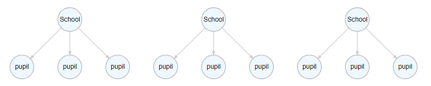
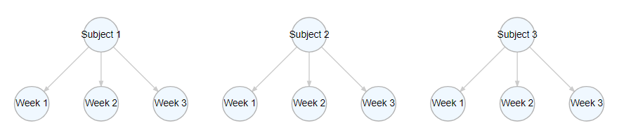

```{r setup, include = FALSE, message = FALSE, warning = FALSE}
options(htmltools.dir.version = FALSE,
        dplyr.summarise.inform = FALSE)
xaringanExtra::use_webcam()
xaringanExtra::use_tile_view()
xaringanExtra::use_extra_styles()
xaringanExtra::use_panelset()
knitr::opts_chunk$set(fig.asp = .618,
                      fig.width = 7,
                      fig.retina = 3)
library(xaringanthemer)
style_mono_light(base_font_size = "21px")
library(tidyverse)
library(lme4)
library(ggforce)
library(sjPlot)
library(DiagrammeR)
library(car)
library(countdown)
library(correlation)
library(equatiomatic)
library(broom)
data(sleepstudy)
```

# Multilevel data

There are *many* situations in psychology where we have *nested* data.

Typical cognitive experiments show participants many repeats of similar trials.


---
# Multilevel data

Intervention studies are typically longitudinal - the same people are tested multiple times on the same outcome measure.

```{r schools, echo = FALSE, fig.height = 6}
a_graph <- 
  create_graph() %>%
  add_node(type = "school",
           label = "School") %>%
  add_node(type = "pupil",
           label = "pupil",
           from = 1) %>%
  add_node(type = "pupil",
           label = "pupil",
           from = 1) %>%
  add_node(type = "pupil",
           label = "pupil",
           from = 1) %>%
  add_node(type = "school",
           label = "School") %>%
  add_node(type = "pupil",
           label = "pupil",
           from = 5) %>%
  add_node(type = "pupil",
           label = "pupil",
           from = 5) %>%
  add_node(type = "pupil",
           label = "pupil",
           from = 5) %>%
  add_node(type = "school",
           label = "School") %>%
  add_node(type = "pupil",
           label = "pupil",
           from = 9) %>%
  add_node(type = "pupil",
           label = "pupil",
           from = 9) %>%
  add_node(type = "pupil",
           label = "pupil",
           from = 9)
# render_graph(a_graph,
#              layout = "tree",
#              width = 850,
#              height = 200)
```


In this example, each pupil is a unit of observation. 

But these pupils are not fully independent from each other - pupils who attend one school tend to be more similar to each other than they are to pupils who attend other schools.

Thus, *pupils* (Level 1) are nested in *schools* (Level 2).

---
# Multilevel data

```{r weeks, echo = FALSE}
b_graph <- 
  create_graph() %>%
  add_node(type = "subject",
           label = "Subject 1") %>%
  add_node(type = "week",
           label = "Week 1",
           from = 1) %>%
  add_node(type = "week",
           label = "Week 2",
           from = 1) %>%
  add_node(type = "week",
           label = "Week 3",
           from = 1) %>%
  add_node(type = "subject",
           label = "Subject 2") %>%
  add_node(type = "week",
           label = "Week 1",
           from = 5) %>%
  add_node(type = "week",
           label = "Week 2",
           from = 5) %>%
  add_node(type = "week",
           label = "Week 3",
           from = 5) %>%
  add_node(type = "subject",
           label = "Subject 3") %>%
  add_node(type = "week",
           label = "Week 1",
           from = 9) %>%
  add_node(type = "week",
           label = "Week 2",
           from = 9) %>%
  add_node(type = "week",
           label = "Week 3",
           from = 9)
# render_graph(b_graph,
#              layout = "tree",
#              width = 850,
#              height = 200)
```



Other data may be *longitudinal*. For example, you may measure outcomes such as, for example, performance or attitudes on repeated occasions to see how they vary over time.

The measurements each week are the main unit of observation, but they are nested within subjects.

---
# Clustered data

.pull-left[
```{r non-clust, echo = FALSE, fig.height = 6, fig.width = 7, fig.asp = NULL}
a <- rnorm(300)
X1 <- rnorm(300)
X2 <- rnorm(300)
Y <- a + X1 * 0.5 + X2 * 0.2 + rnorm(300)
test_model <- lm(Y ~ X1 + X2)
test_resd <- data.frame(fits = fitted(test_model),
                        resids = resid(test_model))
test_resd$Subject <- cut(test_resd$fits,
                             5,
                             labels = 1:5)
ggplot(test_resd, 
       aes(x = fits, 
           y = resids)) +
  xlab("Fitted values") + 
  ylab("Standardized residuals") + 
  theme_bw() + 
  theme(text = element_text(size = 18)) +
  geom_hline(yintercept = 0) +
  geom_point(aes(colour = Subject),
             size = 3,
             alpha = 0.7) 
```
]
.pull-right[
.large[
Data from nested designs like those we have just seen often have *clusters* of correlated observations.

Different people have different reaction speeds, or baseline attitudes; different schools have different teachers and different general environments.
]
]

---
# Clustered data

.pull-left[
```{r corr-subj, echo = FALSE, fig.height = 6, fig.width = 7, fig.asp = NULL}
test_resd <- data.frame(fits = fitted(test_model),
                        resids = resid(test_model))
test_resd$Subject <- cut(test_resd$fits,
                             5,
                             labels = 1:5)
ggplot(test_resd, 
       aes(x = fits, 
           y = resids)) +
  xlab("Fitted values") + 
  ylab("Standardized residuals") + 
  theme_bw() + 
  theme(text = element_text(size = 18)) +
  geom_hline(yintercept = 0) +
  geom_mark_rect(aes(fill = Subject),
                 alpha = 0.5) +
  geom_point(aes(colour = Subject),
             size = 3,
             alpha = 0.7) 
```
]
.pull-right[
.large[
Data from nested designs like those we have just seen often have *clusters* of correlated observations.

Different people have different reaction speeds, or baseline attitudes; different schools have different teachers and different general environments.
]
]

---
class: center, middle, inverse
# The problem with nesting

---
# sleepstudy

.pull-left[
```{r}
head(sleepstudy, 12)
```
]
.pull-right[
The *sleepstudy* dataset contains data from a sleep deprivation experiment. 

Over the course of ten days, subjects were only allowed to sleep for 3 hours each night. 

Each day their reaction times on a variety of cognitive tasks were recorded.

This is a *nested*, multilevel design.

Each observation - average RT on a given day - is nested within a *subject*.
]

---
# sleepstudy

.pull-left[
```{r echo = FALSE, fig.height = 6, fig.width = 7, fig.asp = NULL, message = FALSE}
ggplot(sleepstudy,
       aes(x = Days,
           y = Reaction)) + 
  geom_point() + 
  theme_bw() +
  theme(text = element_text(size = 18)) +
  xlab("Days of sleep deprivation") +
  ylab("Reaction time (ms)") +
  stat_smooth(method = "lm")
```
]
.pull-right[
We could simply fit a linear model to the whole dataset.

```{r}
basic_lm <- lm(Reaction ~ Days,
               data = sleepstudy)
basic_lm
```
]

---

.panelset[
.panel[.panel-name[Joint graph]
.pull-left[
```{r echo = FALSE, fig.height = 5.5, fig.width = 7, fig.asp = NULL, message = FALSE}
ggplot(sleepstudy,
       aes(x = Days,
           y = Reaction,
           colour = Subject)) + 
  geom_point(aes(colour = Subject), size = 2) + 
  theme_bw() +
  theme(text = element_text(size = 18)) +
  xlab("Days of sleep deprivation") +
  ylab("Reaction time (ms)")
```
]
.pull-right[
.large[
But the data clearly has more structure than that!

Here each dot is coloured to show which participant contributed which data points.
]
]
]
.panel[.panel-name[Split panels]
.pull-left[
```{r echo = FALSE, fig.height = 5.5, fig.width = 7, fig.asp = NULL, message = FALSE}
ggplot(sleepstudy,
       aes(x = Days,
           y = Reaction,
           colour = Subject)) + 
  geom_point(aes(colour = Subject), size = 2) + 
  theme_bw() +
  theme(text = element_text(size = 18)) +
  xlab("Days of sleep deprivation") +
  ylab("Reaction time (ms)") +
  facet_wrap(~Subject)
```
]
.pull-right[
.large[
If we split the plot up to show each subject separately, we get more sense of the variability.

For example, Subject 308 shows a very strong effect of sleep deprivation on reaction time, while Subject 309 shows very little effect of sleep deprivation.
]
]
]
.panel[.panel-name[All the things]
.pull-left[
```{r echo = FALSE, fig.height = 6, fig.width = 7, fig.asp = NULL, message = FALSE}
ggplot(sleepstudy,
       aes(x = Days,
           y = Reaction,
           colour = Subject)) + 
  geom_point(aes(colour = Subject), size = 2, alpha = 0.4) + 
  theme_bw() +
  theme(text = element_text(size = 18)) +
  xlab("Days of sleep deprivation") +
  ylab("Reaction time (ms)") +
  stat_smooth(method = "lm", se = FALSE, alpha = 0.4)
```
]
.pull-right[
.large[
Our simple linear model ignores the fact that many of our observations are repeated measurements from each participant.

It assumes the effect is the same for everyone.

There are 18 participants in this study. Some of them are generally faster or slower than others; some of them show more effect of sleep deprivation than others.
]
]
]
]

---
# Simpson's paradox

.pull-left[
```{r echo = FALSE, message = FALSE, fig.height = 6, fig.width = 7, fig.asp = NULL}
corr_dat <- simulate_simpson(groups = 5)
ggplot(corr_dat,
       aes(x = V1, 
           y = V2)) + 
  geom_point() +
  geom_smooth(colour = "black",
              method = "lm",
              se = FALSE) +
  theme_classic()
```
]
.pull-right[
This data has a correlation coefficient of 

**`r round(cor(corr_dat$V1, corr_dat$V2), 2)`**

As V1 increases, V2 decreases!
]

???

This example is based on https://easystats.github.io/correlation/articles/multilevel.html

Makowski, D., Ben-Shachar, M. S., Patil, I., & Lüdecke, D. (2019).
Methods and Algorithms for Correlation Analysis in R. Journal of Open
Source Software, 5(51), 2306. doi:10.21105/joss.02306

---
# Simpson's paradox

.pull-left[
```{r echo = FALSE, message = FALSE, fig.height = 6, fig.width = 7, fig.asp = NULL}
ggplot(corr_dat,
       aes(x = V1, 
           y = V2)) + 
  geom_point(aes(colour = Group)) +
  geom_smooth(colour = "black",
              method = "lm",
              se = FALSE) +
  theme_classic()
```
]
.pull-right[
.large[
But wait!

What is this?

There are five different groups of people?
]
]

???

This example is based on https://easystats.github.io/correlation/articles/multilevel.html

Makowski, D., Ben-Shachar, M. S., Patil, I., & Lüdecke, D. (2019).
Methods and Algorithms for Correlation Analysis in R. Journal of Open
Source Software, 5(51), 2306. doi:10.21105/joss.02306

---
# Simpson's paradox

.pull-left[
```{r echo = FALSE, message = FALSE, fig.height = 6, fig.width = 7, fig.asp = NULL}
ggplot(corr_dat,
       aes(x = V1, 
           y = V2)) + 
  geom_point(aes(colour = Group)) +
  geom_smooth(aes(colour = Group),
              method = "lm",
              se = FALSE) +
  geom_smooth(colour = "black",
              method = "lm",
              se = FALSE) +
  theme_classic()
```
]
.pull-right[
Within each group, the correlation is the other way round - as V1 increase, V2 also increases!

This is known as **Simpson's paradox**, or the *ecological fallacy*.

The effect if grouping is ignored is the *reverse* of the effect in each individual group.
]

???

This example is based on https://easystats.github.io/correlation/articles/multilevel.html

Makowski, D., Ben-Shachar, M. S., Patil, I., & Lüdecke, D. (2019).
Methods and Algorithms for Correlation Analysis in R. Journal of Open
Source Software, 5(51), 2306. doi:10.21105/joss.02306

---
class: inverse, middle, center
# Estimating multilevel models 

---
# Multilevel models

Multilevel models allow us to account for the nested, correlated nature of the data, and explicitly model the variability between people.

You may also see them called:
- Hierarchical models
- Mixed-effects models
- Random-effects models
- Mixed models

---
# Multilevel models using lme4

The most important library for fitting this type of model is `lme4`.

A multilevel model can be fitted with the `lmer()` function.

```{r eval = FALSE}
library(lme4)
multilev <- 
  lmer(Reaction ~ 1 + Days + (1 + Days | Subject), 
       data = sleepstudy)
```

--

lmer(Reaction ~ .blue[1 + Days] + (.red[1 + Days| Subject]),
     data = sleepstudy)

*.blue[Fixed] effects* are highlighted in .blue[blue].

*.red[Random] effects* are highlighted in .red[red].

---
# Fixed and random effects

.large[  
*Fixed effects* are the *population-average* effect: e.g. the *average* effect of days of sleep deprivation on reaction time.

*Random effects* are those that vary across the *sampling units*. e.g. the variation in average reaction time across people

They are *random* because the *sampling units* are randomly drawn from a wider *population*. e.g. the specific participants in an experiment are usually a random subset of all possible participants
]


---
class: inverse, middle, center
# Random intercepts

---
# Individual intercepts

.panelset[
.panel[.panel-name[Individual intercepts]
.pull-left[
```{r echo = FALSE, fig.height = 5, fig.width = 6, fig.asp = NULL}
ggplot(sleepstudy,
       aes(x = Days,
           y = Reaction)) + 
  geom_point(aes(colour = Subject)) + 
  theme_classic() +
  theme(text = element_text(size = 18)) +
  xlab("Days of sleep deprivation") +
  ylab("Reaction time (ms)") +
  stat_smooth(method = "lm",
              formula = y ~ 1,
              se = FALSE,
              aes(colour = Subject),
              alpha = 0.5) +
  #geom_hline(yintercept = coef(basic_lm)[1]) +
   geom_hline(yintercept = coef(basic_lm)[1] + 
                coef(basic_lm)[2] * 
                mean(sleepstudy$Days)) +
  scale_x_continuous(breaks = 0:9) +
  guides(colour = "none")
```
]
.pull-right[
The black line on this plot shows the overall **mean** reaction time. This is the *intercept* of the basic model.

Each coloured line on this plot shows an individual participant's **mean** reaction time.
]
]
.panel[.panel-name[Split by subject]
.pull-left[
```{r indiv-ints, echo = FALSE, fig.height = 5, fig.width=7, fig.asp = NULL}
ggplot(sleepstudy,
       aes(x = Days,
           y = Reaction)) + 
  geom_point(aes(colour = Subject)) + 
  theme_classic() +
  theme(text = element_text(size = 18)) +
  xlab("Days of sleep deprivation") +
  ylab("Reaction time (ms)") +
  facet_wrap(~Subject) +
  stat_smooth(method = "lm",
              formula = y ~ 1,
              se = FALSE,
              aes(colour = Subject)) +
  #geom_hline(yintercept = coef(basic_lm)[1]) +
   geom_hline(yintercept = coef(basic_lm)[1] + 
                coef(basic_lm)[2] * 
                mean(sleepstudy$Days)) +
  scale_x_continuous(breaks = 0:9) +
  guides(colour = "none")
```
]
.pull-right[
If we look at the plots individually for each subject, we can see the individual intercepts a little more clearly. 

Some people are faster on average than the overall mean, while others are slower.

A *random-intercept* model models that variability!

]
]
]

---
# Modelling random intercepts

Remember that in our basic model, the *intercept* represents the mean reaction time.

We can model the variability of the intercept better by including a *random effect* term - *(1 | Subject)*.

```{r}
int_only <- 
  lmer(Reaction ~ 1 + Days + (1 | Subject),
       data = sleepstudy) # Random intercept
```

This model is a *random-intercept* model - it captures how mean reaction times vary across subjects by finding their individual mean reaction times.


---

```{r}
summary(int_only)
```

---

```{r}
tab_model(basic_lm, int_only, dv.labels = c("Reaction time (ms)", "Reaction time (ms)"))
```

---

### Standard linear model
```{r echo = FALSE}
summary(basic_lm)$coefficients
```

### Intercept only mixed-model
```{r echo = FALSE}
summary(int_only)$coefficients
```

The *standard errors* differ, which means the *t-values* differ.

The *intercept* variability increased, while the `Days` variability decreased!

---
# Random effects

.pull-left[
The *fixed* effects give us a measure of average performance and the overall effect of Days of sleep deprivation on RT.
```{r}
fixef(int_only)
```
]
.pull-right[
The *random* effects tell us how much variability there is *between-participants*. 

```{r}
summary(int_only)$varcor
```
]

---
#A quick look at the residuals

.panelset[
.panel[.panel-name[Standard model]
.pull-left[
```{r fig.height=5, message = FALSE, warning = FALSE}
library(performance)
plot(check_normality(basic_lm), type = "qq")
```
]
.pull-right[
These residuals don't look great - our predictions at each end are quite poor, suggesting the model is systematically failing at modelling high or low reaction times.

This suggests there's some structure not being captured by the model.
]
]
.panel[.panel-name[Mixed model]
.pull-left[
```{r fig.height=5, message = FALSE, warning = FALSE}
plot(check_normality(int_only), type = "qq")
```
]
.pull-right[
This model - the *random intercept* model - seems to be doing a better job than our basic linear model.

The points now lie almost entirely along the line.

This indicates a better correspondence between the model predictions and the actual data!
]
]
]

---
#A quick look at the residuals

.panelset[
.panel[.panel-name[Standard model]
.pull-left[
```{r fig.height=5, message = FALSE}
plot(check_heteroscedasticity(basic_lm))
```
]
.pull-right[
This looks a little odd. There is clear grouping, in that it looks a lot like each persons data is grouped together. 

There is a clear shift in the green line - as you go further to the right, the amount of variability is increases.
]
]
.panel[.panel-name[Mixed model]
.pull-left[
```{r fig.height=5, message = FALSE}
plot(check_heteroscedasticity(int_only))
```
]
.pull-right[
This is better, but still shows some issues.

The dots seem to *curve* somewhat.

This suggests there is still something not quite right in our model.
]
]
]

---
class: inverse, middle, center
# Random slopes

---
# Individual slopes

.pull-left[
```{r indiv-regs, echo = FALSE, fig.width = 7, fig.asp = NULL, fig.height=6, message = FALSE}
ggplot(sleepstudy,
       aes(x = Days,
           y = Reaction)) + 
  geom_point() + 
  theme_bw() +
  theme(text = element_text(size = 18)) +
  xlab("Days of sleep deprivation") +
  ylab("Reaction time (ms)") +
  facet_wrap(~Subject) + 
  stat_smooth(method = "lm", se = FALSE) +
  geom_abline(slope = coef(basic_lm)[2],
              intercept = coef(basic_lm)[1])
```
]
.pull-right[
This plot now show individual plots for each participant with the individual effect of `Days` added.

The general trend is consistent, but it's clear that some participants have stronger effects than others. 

And it looks a little like people who are generally fast responders show *less* effect of `Days` of sleep deprivation.
]

---
# Modelling random slopes

We can model how much the effect of `Days` varies between participants by adding  *random slopes* to our model - `(Days | Subject)`.
```{r}
random_slope <- lmer(Reaction ~ 1 + Days + (1 + Days | Subject), 
                     data = sleepstudy)
```

Note that `Days` now appears twice. 

The first time models the *population-average* effect of `Days`.

The second time models the *individual* effect of `Days`.

---

```{r}
summary(random_slope)
```

---

```{r echo = FALSE}
tab_model(int_only, random_slope, dv.labels = c("Reaction times (ms)", "Reaction times (ms)"))
```

---
# Model comparisons

Is this model an improvement? Use `anova()` to check!

```{r}
anova(int_only, random_slope)
```

(it's significant, so yes!)

---
# A quick look at the residuals

.pull-left[
```{r fig.height = 5, message = FALSE}
plot(check_heteroscedasticity(random_slope))
```
]
.pull-right[
.large[
These residuals are the best of all so far.

A few points look suspiciously like outliers, but overall, there's little to suggest any particular problems with this model!
]
]
---


```{r fig.height = 7, fig.width = 10}
check_model(random_slope)
```

---
class: middle, center, inverse
# Multiple random effects

---
# The "language as fixed-effect" fallacy

A common circumstance in psychological research is that we have more than one random effect.

For example, in language experiments, subject often need to read a many different words; these may be words from different categories, or vary in other ways.

These words themselves are random samples, but many researchers treat them as being *fixed*.

[Clark, 1973](https://www.sciencedirect.com/science/article/pii/S0022537173800143)

---
# The `politeness` study

Winter and Grawunder (2012) looked at the relationship between vocal pitch and the level of politeness of a sentence.

Participants were asked to imagine how they would respond to a variety of scenarios when talking politely or informally.

```{r message = FALSE}
politeness <- read_csv("data/politeness_data.csv")
head(politeness)
```

---
# The `politeness` study

In the `politeness` study, there are *two* distinct groupings: 

1) Subjects repeat the same task (imaging a scenario) over and over again 

2) Individual scenarios are repeated by different subjects

Thus there are *two* possible sources of correlated data - we'd expect responses to particular scenarios to be fairly consistent across subjects, and responses by individual subjects to be fairly consistent across items,

---

.panelset[
.panel[.panel-name[All data]
```{r echo = FALSE, fig.align='center', fig.width = 8, message = FALSE}
politeness %>%
  mutate(scenario = as.factor(scenario)) %>%
  ggplot(aes(x = attitude, y = frequency)) +
  geom_jitter(width = 0.02,
              height = 0,
              size = 3) + theme_classic()
```
]
.panel[.panel-name[Subject]
```{r echo = FALSE, fig.align='center', fig.width = 8, message = FALSE}
politeness %>%
  mutate(scenario = as.factor(scenario)) %>%
  ggplot(aes(x = attitude, y = frequency)) +
  geom_jitter(width = 0.04,
              height = 0,
              aes(shape = subject),
              size = 3) + theme_classic()
```
]
.panel[.panel-name[Scenario]
```{r echo = FALSE, fig.align='center', fig.width = 8, message = FALSE}
politeness %>%
  mutate(scenario = as.factor(scenario)) %>%
  ggplot(aes(x = attitude, y = frequency)) +
  geom_jitter(width = 0.04,
              height = 0,
              aes(colour = scenario),
              size = 3) + theme_classic()
```
]
.panel[.panel-name[Both]
```{r echo = FALSE, fig.align='center', fig.width = 8, message = FALSE}
politeness %>%
  mutate(scenario = as.factor(scenario)) %>%
  ggplot(aes(x = attitude, y = frequency)) +
  geom_jitter(width = 0.04,
              height = 0,
              aes(colour = scenario,
                  shape = subject),
              size = 3) + theme_classic()
```
]
]

---
# Variability between subjects

.pull-left[
```{r fig.height=5}
boxplot(frequency ~ subject,
        data = politeness)
```
]
.pull-right[
Individual participants vary in their baseline vocal frequency.

Male participants typically have lower frequency voices than female participants.
]

---
# Variability between scenarios

.pull-left[
```{r fig.height = 5}
boxplot(frequency ~ scenario,
        data = politeness)
```
]
.pull-right[
There seems to be some variability across scenarios.

Scenario 7 seems consistently lower than scenario 4, for example.

But there does seem to be less variability than across participants.

]


---
# Multiple random effects

We can model *both* of these sources of variability simultaneously by adding *multiple random effects*.

```{r}
full_mod <- lmer(frequency ~ attitude + (1|subject) + (1|scenario),
                 data = politeness)
```

Whereas before we only added `(1|subject)`, here we also add `(1|scenario)`. 

This models separate intercepts for each subject and each scenario, allowing for, for example, high-pitched individuals or scenarios that typically elicit low-pitched responses.

---

```{r echo = FALSE}
summary(full_mod)
```

---

```{r echo = FALSE}
tab_model(full_mod, dv.labels = "Frequency (Hz)")
```

---
class: center, middle, inverse
# Some final words and references

---
# Generalized linear mixed effects models

As discussed last week, there are many types of data for which a linear model is *inappropriate*. 

Fortunately, we can fit **generalized linear mixed effects models** too!

`glmer(DV ~ IV1 + IV2 + (IV1 | random_factor), family = binomial(), data = your_data)`

---
# Additional reading

[Complete vs Partial vs no pooling](https://www.tjmahr.com/plotting-partial-pooling-in-mixed-effects-models/)

[An introduction to mixed models](https://gkhajduk.github.io/2017-03-09-mixed-models/)

[Keep it Maximal](https://www.ncbi.nlm.nih.gov/pmc/articles/PMC3881361/)

[Generalizing over encounters: statistical and theoretical considerations](https://psyarxiv.com/mcrzu/)

[Understanding mixed-effects models through data simulation](https://journals.sagepub.com/doi/full/10.1177/2515245920965119)


