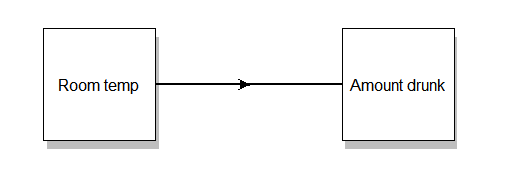

```{r setup, include = FALSE}
options(htmltools.dir.version = FALSE,
        dplyr.summarise.inform = FALSE)
library(xaringanExtra)
xaringanExtra::use_webcam()
xaringanExtra::use_clipboard()
xaringanExtra::use_tile_view()
xaringanExtra::use_extra_styles()
xaringanExtra::use_panelset()
use_freezeframe()
library(xaringanthemer)
style_mono_light(base_font_size = "21px")
library(tidyverse)
library(diagram)
library(psych)
library(psychTools)
library(ggdag)
library(medmod)
library(interactions)
library(processR)
library(sjPlot)
data(epi.bfi)
estress <- read_csv("data/estress.csv")
```

# Mediation and moderation

In linear regression, we're looking to understand the relationship between 
*predictors* and *outcomes*.
.pull-left[
```{r examp-lm, echo = FALSE, fig.height = 5, message = FALSE, fig.width= 6, fig.show = "hide"}
set.seed(200)
theme_set(theme_bw())
a <- rnorm(300)
X <- rnorm(300)
Y <- a + X * 0.5 + 0.5 * rnorm(300)
qplot(X, Y) +
  theme(text = element_text(size = 18)) + 
  stat_smooth(method = "lm")
X1 <- rnorm(300)
X2 <- rnorm(300)
```
`)
]
.pull-right[
```{r echo = FALSE, fig.height=5}
openplotmat(asp = 1)
textrect(c(.1, .5), .1, lab = "X")
textrect(c(.9, .5), .1, lab = "Y")
straightarrow(c(.2, .5), c(.8, .5))
```
]

---
class: inverse, center, middle
# Moderation

---
# Moderation 

Moderation is when the strength of the relationship between two variables depends on a third variable. 

.center[
```{r mod-dia, echo = FALSE, fig.height = 4, eval = FALSE}
pmacroModel(1)
```


]

---
# The *epi.bfi* dataset

The `epi.bfi` dataset from the `psychTools` package

```{r}
head(epi.bfi)
```

---
# Simple linear regression

Let's model `bdi` (Beck Depression Inventory) as a function of `stateanx` (State Anxiety)

```{r}
st_bdi <- lm(bdi ~ stateanx, data = epi.bfi)
summary(st_bdi)
```

---
# Multiple linear regression

An additional predictor that we may find interesting is `epiNeur` - a measure of *neuroticism* from the *Eysenck Personality Inventory*. 

```{r}
st_neu <- lm(bdi ~ stateanx + epiNeur, data = epi.bfi)
summary(st_neu)
```

---
# Adding interaction terms

What if the effect of `stateanx` depends on the level of `epiNeur`? For example, people who score high on *neuroticism* might be more affected by *state anxiety* than people who are low on *neuroticism*. 

We add an interaction to our model using `:` between the two variables:

```{r}
int_model <- lm(bdi ~ stateanx + epiNeur + stateanx:epiNeur,
                data = epi.bfi)
```

We can also use `*` instead of `+`. Thus, `stateanx * epiNeur` will give us the main effect of `stateanx`, the main effect of `epiNeur`, and the interaction between the two.

---
# Moderation

.pull-left[
```{r echo = FALSE}
statisticalDiagram(1)
```
]
.pull-right[
An interaction like this has *three* terms. 

There is a term for each of the main effects.

There is also a term for the interaction, which is the *product* of the two main effects.
]

---

```{r highlight.output=14}
summary(int_model)
```

---
# Interpreting the coefficients

```{r}
coef(int_model)
```

The coefficients tell you what the effect of a 1 unit increase in the variable has on the dependent variable.

But the coefficients of the main effects (`stateanx` and `epiNeur`) are hard to interpret *in the presence of an interaction* unless the variables have been **centred**. 

---
# Interpreting the coefficients

```{r}
coef(int_model)
```

When the predictors are uncentred, these coefficients tell us (*take a deep breath*) 

- the effect of a 1 unit increase in `stateanx` when `epiNeur` is 0 
- the effect of a 1 unit increase in `epiNeur` when `stateanx` is 0 
- the difference between the effect of a 1 unit increase in `stateanx` when `epiNeur` is 0 and the increase in `stateanx` when `epiNeur` is 1, and the difference between the effect of a 1 unit the increase in `epiNeur` when `stateanx` is 0 and the increase in `epiNeur` when `stateanx` is 1

(or something like that)

---
# Mean-centring

We can use the `scale()` function to perform mean-centring, standardization, or both.

```{r}
cent_model <- lm(bdi ~ scale(stateanx, scale = FALSE) * scale(epiNeur, scale = FALSE), 
                 data = epi.bfi)
coef(cent_model)
```
```{r}
coef(st_neu)
```

---

```{r}
tab_model(st_neu, int_model)
```
---
# Simple slopes

.pull-left[
The `interact_plot()` function from the `interactions` package provides a nice way to visualize the interaction.

We look at the steepness of the slope at different levels of one of the variables.

```{r simp-slope, fig.height=5, fig.show = "hide"}
interact_plot(int_model,
              pred = stateanx,
              modx = epiNeur)
```
]
.pull-right[
`)
]

---
# Simple slopes

.pull-left[
We can also add individual data points using `plot.points = TRUE`.

Confidence intervals can be added using `interval = TRUE`.

```{r simp-points, fig.height=5, fig.show = "hide"}
interact_plot(int_model,
              pred = stateanx,
              modx = epiNeur,
              plot.points = TRUE,
              interval = TRUE)
```
]
.pull-right[
`)
]


---
# Simple slopes

The interaction means that the *slope* of the effect of `stateanx` differs at different values of `epiNeur`.

We can use the `sim_slopes()` function from `interactions` to statistically explore how `stateanx` varies as a function of `epiNeur`.

```{r eval = FALSE}
sim_slopes(int_model,
           pred = stateanx,
           modx = epiNeur,
           johnson_neyman = FALSE)
```

---

```{r echo = FALSE}
sim_slopes(int_model,
           pred = stateanx,
           modx = epiNeur,
           johnson_neyman = FALSE)
```

The slope of `stateanx` *increases* as `epiNeur` increases.

---
# Johnson-Neyman plots

```{r fig.height=4, fig.width = 6, message = FALSE, fig.show = "hide"}
johnson_neyman(int_model, pred = stateanx, modx = epiNeur)
```


---
class: inverse, center, middle
# Mediation

---
# Mediation

Mediation refers to a situation in which the effect of a predictor is transmitted *through* another variable.

```{r echo = FALSE, fig.show = "hide"}
pmacroModel(4,
            radx = .1)
```
.center[

]

---
# Mediation

In this example, *room temperature* predicts the *amount that people drink*; specifically, we'd expect that higher temperatures would increase drinking.

.center[
```{r echo = FALSE, fig.show = "hide"}
openplotmat(asp = 1)
textrect(c(.1, .5), radx = .15, lab = "Room temp")
textrect(c(.9, .5), radx = .15, lab = "Amount drunk")
straightarrow(c(.25, .5), c(.75, .5))
```

]

---
# Mediation

Nevertheless, it's possible that higher temperatures increase drinking *indirectly*: higher temperatures make people feel more *thirsty*, which in turn makes them *drink more*.

.center[
```{r echo = FALSE, fig.show = "hide"}
pmacroModel(4,
            labels = list(X = "Room temp",
                          Mi = "Thirst",
                          Y = "Amount drunk"),
            radx = .1)
```

]

---
# Mediation path diagram

.pull-left[
```{r echo = FALSE}
statisticalDiagram(4)
```
]
.pull-right[
$a$ - the effect of the IV on the mediator

$b$ - the effect of the mediator on the DV

$c'$ - the *direct* effect of the IV on the DV 

Missing here are path $c$ - the *total* effect of the IV on the DV - and path $ab$ - the *indirect* effect of the IV on the DV
]

---
# Mediation as regression

Baron & Kenny (1986) outline steps to estimate each *path* with regression.

```{r echo = FALSE}
statisticalDiagram(4)
```

---
# The `estress` data

```{r echo = FALSE}
head(estress, 5)
```

Pollack, J., VanEpps, E. M., & Hayes, A. F. (2012). The moderating role of social ties on entrepreneurs' depressed affect and withdrawal intentions in response to economic stress. Journal of Organizational Behavior, 33, 789-810.

---
# Path *c* - the *total* effect

This is the effect of the IV on the DV.

```{r highlight.output = 12}
path_c <- lm(withdraw ~ estress, data = estress)
summary(path_c)
```

---
# Path *a* 

This is the effect of the IV on the Mediator.

```{r highlight.output = 12}
path_a <- lm(affect ~ estress, data = estress)
summary(path_a)
```

---
# Path *b* 

This is the effect of the mediator on the DV, controlling for the IV.

```{r highlight.output = 12}
path_b <- lm(withdraw ~ affect, data = estress)
summary(path_b)
```

---
# Path *c'* - the direct effect

This checks whether the IV predicts the DV after controlling for the mediator. 

```{r highlight.output = 13}
path_c_dir <- lm(withdraw ~ affect + estress, data = estress)
summary(path_c_dir)
```

---
# Is there mediation?

Now that we've fit all these models, how do we work out if there is *mediation*?

Does the effect of `estress` differ after controlling for `affect`?

```{r}
tab_model(path_c, path_c_dir)
```

---
# Is there mediation?

We need to calculate the *indirect* effect. There are two ways to do that.

.panelset[
.panel[.panel-name[Difference method]
```{r}
coef(path_c)["estress"] - coef(path_c_dir)["estress"]
```
]
.panel[.panel-name[Product method]
```{r}
coef(path_a)["estress"] * coef(path_c_dir)["affect"]
```
]
.panel[.panel-name[Which one to use?]
.center[

]
]
]

---
# Is there a mediation?

```{r}
 coef(path_c)["estress"] - coef(path_c_dir)["estress"]
```

Calculating the indirect effect is simple enough - it looks like there is some effect of `estress` transmitted, so we may well have mediation.

But we still need to test if this is *significant*.

 - The Sobel test (don't use this)
 - Bootstrapping (use this)
 
---
# Bootstrapping

Bootstrapping is a non-parametric resampling method.

The data is *resampled with replacement* many times over, and the test statistic is calculated each time. 

For mediation, the statistic that's calculated each time is the *indirect effect*.

This creates a *distribution* of possible values for the test statistic, from which we can calculate *confidence intervals*.

(this is what the PROCESS macro in SPSS does)

---
# Mediation model 

We can use the `mediate()` function from the `psych` package to add a mediating variable. **Importantly,** we place `()` around the mediator.

.pull-left[
```{r fig.show = "hide"}
medi_model <- mediate(withdraw ~ estress + (affect),
                      data = estress)
```

]
.pull-right[
We can use the difference between $c'$ and $c$ as the *indirect* effect, so the *indirect effect* of `estress` is around **.14**.

When `estress` increases by 1, `affect` increases by .17; and when `affect` increases by 1, `withdraw` increases by .77.

So `estress` is increasing `affect` which is increasing `withdraw`.
]

---

```{r echo = FALSE}
summary(medi_model)
```

---

```{r echo = FALSE, highlight.output = 27}
summary(medi_model)
```

---
class: center, middle, inverse
# Some final notes

---
# Multiple mediation

```{r multimed, fig.show = "hide"}
multi_medi <- mediate(withdraw ~ estress + (affect) + (tenure),
                      data = estress)
```
.pull-left[
`)
]
.pull-right[
It's also possible to have multiple mediators! 

Simply add additional predictors surrounded by brackets. 

In this one, all the mediation is via `affect` - `tenure` doesn't influence `withdraw`.
]

---
# Moderated mediation

It's also possible to do *moderated mediation*. Simply include interaction terms for moderators. Have fun interpreting these `r emo::ji("smiling face with horns")`

```{r fig.align = "center", fig.width = 8, fig.height = 4.5, fig.asp = NULL}
mod_medi <- mediate(withdraw ~ estress + affect*sex + (affect),
                    data = estress)
```

---
# Further reading

Baron, R. M., & Kenny, D. A. (1986). The moderator–mediator variable distinction in social psychological research: Conceptual, strategic, and statistical considerations. *Journal of Personality and Social Psychology, 5, 1173-1182.*

Shrout, P. E., & Bolger, N. (2002). Mediation in experimental and nonexperimental studies: new procedures and recommendations. *Psychological Methods, 7, 422-445.*

Hayes AF. Introduction to mediation, moderation, and conditional process analysis: a regression-based approach. New York: Guilford Press; 2013.

---
# Additional packages

The [lavaan](https://lavaan.ugent.be/index.html) package for Structural Equation Modelling can be used to fit all sort of complicated models. 

```{r eval = FALSE}
model <- ' # direct effect
             Y ~ c*X
           # mediator
             M ~ a*X
             Y ~ b*M
           # indirect effect (a*b)
             ab := a*b
           # total effect
             total := c + (a*b)
         '
fit <- sem(model, data = Data)
```

---
# Additional packages

The `medmod` package can handle simple models, and has some nice, readable output.

```{r}
library(medmod)
med_model <- med(data = estress, dep = "withdraw",
                 pred = "estress", med = "affect",
                 paths = TRUE, estPlot = TRUE,
                 pm = TRUE)
med_model$med
```

---
# Mediation with `med()` from `medmod`

```{r}
med_model$paths
```

PS this output looks better direct from R...!

---
# Mediation with `med()` from `medmod`

.pull-left[
```{r message = FALSE, fig.height = 5}
med_model$estPlot
```
]
.pull-right[
As long as the confidence intervals don't overlap 0 for the indirect effect, we have a significant mediation.
]
