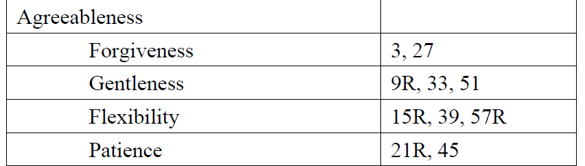

```{r setup, include = FALSE}
options(htmltools.dir.version = FALSE,
        dplyr.summarise.inform = FALSE)
library(xaringanExtra)
library(xaringanthemer)
xaringanExtra::use_webcam()
xaringanExtra::use_clipboard()
xaringanExtra::use_tile_view()
xaringanExtra::use_extra_styles()
xaringanExtra::use_panelset()
style_solarized_light(base_font_size = "20px")
library(tidyverse)
library(psych)
library(psychTools)
library(gt)
library(ggforce)
library(truncnorm)
library(ggstatsplot)
library(parameters)
crime <- read_csv("data/FearofCrime.csv")
```

# Psychometrics

Many of the things we want to measure are *constructs* that are not *directly* measurable. e.g. IQ, anxiety, risk 

.pull-left[
.center[

]
]
.pull-right[

"A group of blind men heard that a strange animal, called an elephant, had been brought to the town, but none of them were aware of its shape and form. Out of curiosity, they said: "We must inspect and know it by touch, of which we are capable"."
We can try to capture different *aspects* of latent variables.

For example, we might ask a variety of different questions as with standard scales and questionnaires like
- HEXACO
- Historical Clinical Risk Management-20 (HCR-20)
- Patient Health Questionnaire 9 (PHQ-9)
]

???

Blind Men Appraising an Elephant by Ohara Donshu, Edo Period (early 19th century), Brooklyn Museum. From [Wikipedia](https://en.wikipedia.org/wiki/Blind_men_and_an_elephant)

---
# Psychometrics

Many of the things we want to measure are *constructs* that are not *directly* measurable. e.g. IQ, anxiety, risk 

.pull-left[
.center[

]
]
.pull-right[

We can try to capture different *aspects* of latent variables.

For example, we might ask a variety of different questions as with standard scales and questionnaires like
- HEXACO
- Historical Clinical Risk Management-20 (HCR-20)
- Patient Health Questionnaire 9 (PHQ-9)
]

???

Blind Men Appraising an Elephant by Ohara Donshu, Edo Period (early 19th century), Brooklyn Museum. From [Wikipedia](https://en.wikipedia.org/wiki/Blind_men_and_an_elephant)

---
# The HEXACO personality measures

The HEXACO scale measures personality using 60 or 100 item questionnaires. 

These questionnaires supposedly breaks personality down into six different factors:

-  Honesty-Humility
-  Emotionality
-  eXtraversion [sic]
-  Agreeableness
-  Conscientiousness
-  Openness to Experience


---
#Example HEXACO items

```{r echo = FALSE}
knitr::include_graphics("images/hexaco1-10.png")
```

---
class: inverse, center, middle
# Performing factor and component analysis

---
# Graphical representation of factor analysis

.pull-left[
```{r echo = FALSE, fig.height = 4}
set.seed(106)
class_dims <- 
  data.frame(x = c(rtruncnorm(5, 0, sd = 0.2,
                              a = -1, b = 1),
                   rtruncnorm(5, .75, sd = .2,
                              a = -1, b = 1)),
             y = c(rtruncnorm(5, 0.8, sd = 0.2,
                              a = -1, b = 1),
                   rtruncnorm(5, 0, sd = .2,
                              a = -1, b = 1)),
             group = rep(c("People who like dogs",
                           "People who suck"),
                         each = 5)) 
first_plot <- 
  ggplot(class_dims,
       aes(x = x, y = y)) +
  geom_point(size = 5) +
  theme_void() + 
  lims(x = c(-1, 1),
       y = c(-1, 1)) +
  theme(text = element_text(size = 20)) 
first_plot + 
  geom_vline(xintercept = -1) + 
  geom_hline(yintercept = -1)
```
]
.pull-right[
Each axis is a *dimension* relating to an underlying construct. 

In this example, based on the HEXACO scale, the x-axis represents the *Honesty-Humility* dimension, while the y-axis represents the *Emotionality* dimension.

]

---
# Graphical representation of factor analysis

.pull-left[
```{r echo = FALSE, fig.height = 4}
first_plot + 
  geom_vline(xintercept = -1) + 
  geom_hline(yintercept = -1) +
  geom_mark_rect(aes(fill = group)) +
  scale_fill_brewer(palette = "Dark2") +
  theme(text = element_text(size = 20),
        legend.position = "none") 
```
]
.pull-right[
Each axis is a *dimension* relating to an underlying construct. 

In this example, based on the HEXACO scale, the x-axis represents the *Honesty-Humility* dimension, while the y-axis represents the *Emotionality* dimension.

Each dot represents the score on an individual item. The points that cluster together are correlated and are measuring part of the same underlying dimension.

]

---
# Graphical representation of factor analysis

.pull-left[
```{r echo = FALSE, fig.height = 4}
first_plot + 
  geom_vline(xintercept = 0) + 
  geom_hline(yintercept = 0) +
  geom_mark_rect(aes(fill = group)) +
  scale_fill_brewer(palette = "Dark2") +
  theme(text = element_text(size = 20),
        legend.position = "none") 
```
]
.pull-right[
Each axis is a *dimension* relating to an underlying construct. 

In this example, based on the HEXACO scale, the x-axis represents the *Honesty-Humility* dimension, while the y-axis represents the *Emotionality* dimension.

Each dot represents the score on an individual item. The points that cluster together are correlated and are measuring part of the same underlying dimension.

We can shift the *axes* to pass through these points. 
]

---
# Factor loadings

.pull-left[
```{r class-dim, echo = FALSE, fig.show = "hide"}
ggplot(class_dims, 
       aes(x = x, y = y)) +
  geom_point(size = 3) +
  lims(x = c(-1, 1), y = c(-1, 1)) + 
  geom_vline(xintercept = 0) + 
  geom_hline(yintercept = 0) + 
  theme_classic() + 
  geom_mark_rect(aes(fill = group)) + 
  labs(x = "Honesty-Humility",
       y = "Emotionality") + 
  coord_equal() +
  theme(text = element_text(size = 20),
        legend.position = "none") + 
  scale_fill_brewer(palette = "Dark2")
```

Items that measure the *Emotionality* factor cluster - or **load** - high on the y-axis. 

Items that measure the *Honesty-Humility* factor load high on the x-axis.

]
.pull-right[
`)
]

---
# Factor loadings

.pull-left[
Items that measure the *Emotionality* factor cluster - or **load** - high on the y-axis. 

Items that measure the *Honesty-Humility* factor load high on the x-axis.

The distance of an item from zero on a particular dimension indicates how heavily the item *loads* on that dimensions.
]
.pull-right[
```{r both-facs, echo = FALSE}
ggplot(class_dims, 
       aes(x = x, y = y)) +
  geom_point(size = 5) +
  lims(x = c(-1, 1), y = c(-1, 1)) + 
  geom_vline(xintercept = 0) + 
  geom_hline(yintercept = 0) + 
  theme_classic() + 
  geom_mark_rect(aes(fill = group)) +
  scale_fill_brewer(palette = "Dark2") +
  labs(x = "Honesty-Humility",
       y = "Emotionality") + 
  coord_equal() +
  theme(text = element_text(size = 20),
        legend.position = "none") + 
  annotate("segment",
           x = class_dims$x[1], xend = 0,
           y = class_dims$y[1], yend = class_dims$y[1],
           linetype = "dashed",
           size = 1.5,
           alpha = 0.5) + 
  annotate("segment",
           x = class_dims$x[2], xend = 0,
           y = class_dims$y[2], yend = class_dims$y[2],
           linetype = "dashed",
           size = 1.5,
           alpha = 0.5) +
  annotate("segment",
           x = class_dims$x[3], xend = 0,
           y = class_dims$y[3], yend = class_dims$y[3],
           linetype = "dashed",
           size = 1.5,
           alpha = 0.5)+
  annotate("segment",
           x = class_dims$x[4], xend = 0,
           y = class_dims$y[4], yend = class_dims$y[4],
           linetype = "dashed",
           size = 1.5,
           alpha = 0.5) +
  annotate("segment",
           x = class_dims$x[5], xend = 0,
           y = class_dims$y[5], yend = class_dims$y[5],
           linetype = "dashed",
           size = 1.5,
           alpha = 0.5) +
  annotate("segment",
           x = class_dims$x[6], xend = 0,
           y = class_dims$y[6], yend = class_dims$y[6],
           linetype = "dashed",
           size = 1.5,
           alpha = 0.5) +
  annotate("segment",
           x = class_dims$x[7], xend = 0,
           y = class_dims$y[7], yend = class_dims$y[7],
           linetype = "dashed",
           size = 1.5,
           alpha = 0.5) +
  annotate("segment",
           x = class_dims$x[8], xend = 0,
           y = class_dims$y[8], yend = class_dims$y[8],
           linetype = "dashed",
           size = 1.5,
           alpha = 0.5) +
  annotate("segment",
           x = class_dims$x[9], xend = 0,
           y = class_dims$y[9], yend = class_dims$y[9],
           linetype = "dashed",
           size = 1.5,
           alpha = 0.5) +
  annotate("segment",
           x = class_dims$x[10], xend = 0,
           y = class_dims$y[10], yend = class_dims$y[10],
           linetype = "dashed",
           size = 1.5,
           alpha = 0.5) + 
  annotate("segment",
           x = class_dims$x[1], xend = class_dims$x[1],
           y = 0, yend = class_dims$y[1],
           linetype = "dashed",
           size = 1.5,
           alpha = 0.5) + 
  annotate("segment",
           x = class_dims$x[2], xend = class_dims$x[2],
           y = 0, yend = class_dims$y[2],
           linetype = "dashed",
           size = 1.5,
           alpha = 0.5) +
  annotate("segment",
           x = class_dims$x[3], xend = class_dims$x[3],
           y = 0, yend = class_dims$y[3],
           linetype = "dashed",
           size = 1.5,
           alpha = 0.5)+
  annotate("segment",
           x = class_dims$x[4], xend = class_dims$x[4],
           y = 0, yend = class_dims$y[4],
           linetype = "dashed",
           size = 1.5,
           alpha = 0.5) +
  annotate("segment",
           x = class_dims$x[5], xend = class_dims$x[5],
           y = 0, yend = class_dims$y[5],
           linetype = "dashed",
           size = 1.5,
           alpha = 0.5) +
  annotate("segment",
           x = class_dims$x[6], xend = class_dims$x[6],
           y = 0, yend = class_dims$y[6],
           linetype = "dashed") +
  annotate("segment",
           x = class_dims$x[7], xend = class_dims$x[7],
           y = 0, yend = class_dims$y[7],
           linetype = "dashed",
           size = 1.5,
           alpha = 0.5) +
  annotate("segment",
           x = class_dims$x[8], xend = class_dims$x[8],
           y = 0, yend = class_dims$y[8],
           linetype = "dashed",
           size = 1.5,
           alpha = 0.5) +
  annotate("segment",
           x = class_dims$x[9], xend = class_dims$x[9],
           y = 0, yend = class_dims$y[9],
           linetype = "dashed",
           size = 1.5,
           alpha = 0.5) +
  annotate("segment",
           x = class_dims$x[10], xend = class_dims$x[10],
           y = 0, yend = class_dims$y[10],
           linetype = "dashed",
           size = 1.5,
           alpha = 0.5)
```
]

---
# Factor loadings

.pull-left[
The items that load on the Honesty-Humility axis are close to the centre of the *y-axis*, but distant from zero on the *x-axis*.
]
.pull-right[
```{r fac-load-emo, echo = FALSE}
ggplot(class_dims, 
       aes(x = x, y = y)) +
  geom_point(size = 5) +
  lims(x = c(-1, 1), y = c(-1, 1)) + 
  geom_vline(xintercept = 0) + 
  geom_hline(yintercept = 0) + 
  theme_classic() + 
  labs(x = "Honesty-Humility",
       y = "Emotionality") + 
  coord_equal() +
  geom_mark_rect(aes(fill = group)) +
  scale_fill_brewer(palette = "Dark2") +
  theme(text = element_text(size = 20),
        legend.position = "none") + 
  annotate("segment",
           x = class_dims$x[1], xend = 0,
           y = class_dims$y[1], yend = class_dims$y[1],
           linetype = "dashed",
           size = 1.5,
           alpha = 0.5) + 
  annotate("segment",
           x = class_dims$x[2], xend = 0,
           y = class_dims$y[2], yend = class_dims$y[2],
           linetype = "dashed",
           size = 1.5,
           alpha = 0.5) +
  annotate("segment",
           x = class_dims$x[3], xend = 0,
           y = class_dims$y[3], yend = class_dims$y[3],
           linetype = "dashed",
           size = 1.5,
           alpha = 0.5)+
  annotate("segment",
           x = class_dims$x[4], xend = 0,
           y = class_dims$y[4], yend = class_dims$y[4],
           linetype = "dashed",
           size = 1.5,
           alpha = 0.5) +
  annotate("segment",
           x = class_dims$x[5], xend = 0,
           y = class_dims$y[5], yend = class_dims$y[5],
           linetype = "dashed",
           size = 1.5,
           alpha = 0.5) +
  annotate("segment",
           x = class_dims$x[6], xend = 0,
           y = class_dims$y[6], yend = class_dims$y[6],
           linetype = "dashed",
           size = 1.5,
           alpha = 0.5) +
  annotate("segment",
           x = class_dims$x[7], xend = 0,
           y = class_dims$y[7], yend = class_dims$y[7],
           linetype = "dashed",
           size = 1.5,
           alpha = 0.5) +
  annotate("segment",
           x = class_dims$x[8], xend = 0,
           y = class_dims$y[8], yend = class_dims$y[8],
           linetype = "dashed",
           size = 1.5,
           alpha = 0.5) +
  annotate("segment",
           x = class_dims$x[9], xend = 0,
           y = class_dims$y[9], yend = class_dims$y[9],
           linetype = "dashed",
           size = 1.5,
           alpha = 0.5) +
  annotate("segment",
           x = class_dims$x[10], xend = 0,
           y = class_dims$y[10], yend = class_dims$y[10],
           linetype = "dashed",
           size = 1.5,
           alpha = 0.5) 
```
]

---
# Factor loadings

.pull-left[
The items that load on the Honesty-Humility axis are close to the centre of the *y-axis*, but distant from zero on the *x-axis*.

The items that load on the Emotionality factor are close to the centre of the *x-axis*, but distant from zero on the *y-axis*.
]
.pull-right[
```{r fac-dim-hum, echo = FALSE}
ggplot(class_dims, 
       aes(x = x, y = y)) +
  geom_point(size = 5) +
  lims(x = c(-1, 1), y = c(-1, 1)) + 
  geom_vline(xintercept = 0) + 
  geom_hline(yintercept = 0) + 
  theme_classic() + 
  labs(x = "Honesty-Humility",
       y = "Emotionality") + 
  coord_equal() +
  geom_mark_rect(aes(fill = group)) +
  scale_fill_brewer(palette = "Dark2") +
  theme(text = element_text(size = 20),
        legend.position = "none") + 
  annotate("segment",
           x = class_dims$x[1], xend = class_dims$x[1],
           y = 0, yend = class_dims$y[1],
           linetype = "dashed",
           size = 1.5,
           alpha = 0.5) + 
  annotate("segment",
           x = class_dims$x[2], xend = class_dims$x[2],
           y = 0, yend = class_dims$y[2],
           linetype = "dashed",
           size = 1.5,
           alpha = 0.5) +
  annotate("segment",
           x = class_dims$x[3], xend = class_dims$x[3],
           y = 0, yend = class_dims$y[3],
           linetype = "dashed",
           size = 1.5,
           alpha = 0.5)+
  annotate("segment",
           x = class_dims$x[4], xend = class_dims$x[4],
           y = 0, yend = class_dims$y[4],
           linetype = "dashed",
           size = 1.5,
           alpha = 0.5) +
  annotate("segment",
           x = class_dims$x[5], xend = class_dims$x[5],
           y = 0, yend = class_dims$y[5],
           linetype = "dashed",
           size = 1.5,
           alpha = 0.5) +
  annotate("segment",
           x = class_dims$x[6], xend = class_dims$x[6],
           y = 0, yend = class_dims$y[6],
           linetype = "dashed",
           size = 1.5,
           alpha = 0.5) +
  annotate("segment",
           x = class_dims$x[7], xend = class_dims$x[7],
           y = 0, yend = class_dims$y[7],
           linetype = "dashed",
           size = 1.5,
           alpha = 0.5) +
  annotate("segment",
           x = class_dims$x[8], xend = class_dims$x[8],
           y = 0, yend = class_dims$y[8],
           linetype = "dashed",
           size = 1.5,
           alpha = 0.5) +
  annotate("segment",
           x = class_dims$x[9], xend = class_dims$x[9],
           y = 0, yend = class_dims$y[9],
           linetype = "dashed",
           size = 1.5,
           alpha = 0.5) +
  annotate("segment",
           x = class_dims$x[10], xend = class_dims$x[10],
           y = 0, yend = class_dims$y[10],
           linetype = "dashed",
           size = 1.5,
           alpha = 0.5) 
```
]

---
# Factor loadings

.pull-left[
Let's add a third set of items, a set of items that correlate with each other but not with either existing cluster.

These clearly load negatively on both our existing factors, but we may need another factor to characterise them properly.
]

.pull-right[
```{r echo = FALSE}
ggplot(class_dims, 
       aes(x = x, y = y)) +
  geom_point(size = 5) +
  lims(x = c(-1, 1), y = c(-1, 1)) + 
  geom_vline(xintercept = 0) + 
  geom_hline(yintercept = 0) + 
  theme_classic() + 
  geom_mark_rect(aes(fill = group)) + 
  labs(x = "Honesty-Humility",
       y = "Emotionality") + 
  coord_equal() +
  theme(text = element_text(size = 20),
        legend.position = "none") + 
  annotate("point", x = -.6, y = -.56,
           size = 5, shape = 3) + 
  annotate("point", x = -.54, y = -.68,
           size = 5, shape = 3) + 
  annotate("point", x = -.63, y = -.61,
           size = 5, shape = 3) + 
  annotate("point", x = -.73, y = -.63,
           size = 5, shape = 3) + 
  annotate("point", x = -.65, y = -.72,
           size = 5, shape = 3) + 
  scale_fill_brewer(palette = "Dark2")

```
]

---
# Factor loadings

.pull-left[
Let's add a third set of items, a set of items that correlate with each other but not with either existing cluster.

These clearly load negatively on both our existing factors, but we may need another factor to characterise them properly.

For each distinct *factor*, we need an additional *dimension*.
]
.pull-right[
```{r echo = FALSE}
ggplot(class_dims, 
       aes(x = x, y = y)) +
  geom_point(size = 5) +
  lims(x = c(-1, 1), y = c(-1, 1)) + 
  geom_vline(xintercept = 0) + 
  geom_hline(yintercept = 0) + 
  theme_classic() + 
  geom_mark_rect(aes(fill = group)) + 
  labs(x = "Honesty-Humility",
       y = "Emotionality") + 
  coord_equal() +
  theme(text = element_text(size = 20),
        legend.position = "none") + 
  annotate("point", x = -.6, y = -.56,
           size = 5, shape = 3) + 
  annotate("point", x = -.54, y = -.68,
           size = 5, shape = 3) + 
  annotate("point", x = -.63, y = -.61,
           size = 5, shape = 3) + 
  annotate("point", x = -.73, y = -.63,
           size = 5, shape = 3) + 
  annotate("point", x = -.65, y = -.72,
           size = 5, shape = 3) + 
  geom_abline(slope = 1, intercept = 0, linetype = "dashed") + 
  scale_fill_brewer(palette = "Dark2")

```
]

---
class: inverse, center, middle
# Preparing for factor analysis

---
# The *R-matrix*

.pull-left[
*Correlations* are at the heart of how we understand which of our questionnaire items measure the same *factors*.

There are 60-item and 100-item versions of the HEXACO.

Here we take a look a small subset of those items.

We have *two clusters* of items that correlate with *with each other* but not with the items in the *other* cluster.
]
.pull-right[
```{r corr-dims, echo = FALSE, fig.height = 6}
hexaco_only <- select(crime, hexaco1:hexaco60)

hexaco_subset <- 
  select(crime, hexaco1:hexaco60) %>%
    select(6, 36, 54, 17, 29, 47) 
ggstatsplot::ggcorrmat(hexaco_subset)
```
]

---
# The identity matrix

The matrix on the right is the *identity* matrix - this is what the correlation matrix would be like without structure.

.pull-left[
```{r echo = FALSE, fig.height = 4}
corPlot(hexaco_subset)
```
]
.pull-right[
```{r echo = FALSE, fig.height = 4}
corPlot(diag(6))
```
]

---
# Checking the *R-matrix*

We need to know whether there is sufficient correlative structure in the data!

The *Bartlett* test - run using the `check_sphericity()` function from `parameters` - is used to check whether the correlation matrix significantly differs from the *identity* matrix.
```{css echo = FALSE}
pre code {
  white-space: pre-wrap;
}
```
```{r}
check_sphericity(hexaco_subset)
```

---
# Checking sampling adequacy

We also need to know if there is enough variability in the data. 

The Kaiser-Meyer-Olkin statistic measures the degree to which each variable in the data can be predicted from the other variables.

KMO ranges from 0 to 1; values above .7 are generally considered acceptable.

```{r highlight.output=3}
check_kmo(hexaco_only)
```

---
# Checking for sufficient factor structure

The `check_factorstructure()` function from `parameters` does both of these at once!

```{r}
check_factorstructure(hexaco_only)
```

---
class: inverse, middle, center
# How many factors do we need?

---
# How many factors do we need?

.pull-left[
We need to figure out how many factors we need to break down our data.

In theory, we could have one per item.

... but that would be a lot of factors.

Here, it looks like there are at least five different groups.
]
.pull-right[
```{r echo = FALSE}
latest_data <- 
  data.frame(x = c(rtruncnorm(5, .1, sd = .2,
                              a = -1, b = 1),
                   rtruncnorm(5, -.3, sd = .2,
                              a = -1, b = 1),
                   rtruncnorm(5, -.8, sd = .2,
                              a = -1, b = 1)),
             y = c(rtruncnorm(5, .1, sd = .2,
                              a = -1, b = 1),
                   rtruncnorm(5, -.5, sd = .2,
                              a = -1, b = 1),
                   rtruncnorm(5, .8, sd = .2,
                              a = -1, b = 1)))
latest_data <- rbind(class_dims[, 1:2],
                     latest_data)
latest_data$group <- rep(1:5, each = 5)
 
new_plot <- 
  ggplot(latest_data,
        aes(x = x, y = y)) + 
   geom_point(size = 5) +
   lims(x = c(-1, 1), 
        y = c(-1, 1)) + 
   theme_void() + 
   geom_vline(xintercept = 0) +
   geom_hline(yintercept = 0)
new_plot +
  geom_mark_rect(aes(group = group)) +
  theme(legend.position = "none")
```
]

---
# Scree plots

.pull-left[
Catell (1966) proposed the scree plot as a way to choose how many factors to keep.

The y-axis shows the eigenvalue of each potential factor, up to the maximum number possible.
```{r scree-plot1, fig.show = "hide"}
scree(hexaco_only, factors = FALSE)
```
]

.pull_right[
`)
]

---
# Eigenvalues

Eigenvalues tell us how much variance a particular factor explains.

Higher values mean more variance explained, and the more variance a factor explains, the more important it is.

They help us determine whether a factor is worth *extracting* for further analysis.

```{r}
eigen(cor(hexaco_only))$values
```

---
# Scree plots

.pull-left[
We look for the *point of inflexion* - the point at which the eigenvalues have (more or less) stopped decreasing much.

It's probably around 9 components here!
]

.pull_right[
```{r screeplotmark, echo = FALSE}
scree(hexaco_only, factors = FALSE)
abline(v = 9.5, h = 1.5, lty = 2)
```
]

---
# Kaiser's criterion

.pull-left[
An alternative to looking for the point of inflexion is to keep any factor where the eigenvalue is higher than 1 - this is called *Kaiser's criterion*.

This would pick out around *16* factors here.

Kaiser's criterion tends to keep too many factors.
]
.pull-right[
```{r echo = FALSE}
scree(hexaco_only, factors = FALSE)
```
]

---
# Parallel analysis

.pull-left[
Arguably the best method is **Parallel Analysis**, using the **fa.parallel()** function.

In parallel analysis, *random* data is generated and compared to the *true* data.

Factors above the *red* line should be kept. Here, it's 9, just like our "point of inflexion" rule would suggest.

```{r parallel-fa, fig.show = "hide"}
fa.parallel(hexaco_only,
            fa = "pc")
```
]

.pull-right[
`)
]

---
class: center, middle, inverse
# Principal Component Analysis

---
# Principal Component Analysis

There are a number of differenct factor analysis methods available. We'll look at PCA. PCA is a *dimension reduction* method.

It produces a *simplified model* of the data that captures the inter-relationships between variables.

To run PCA on this kind of data, we can use the **principal()** function from the **psych** package.
```{r eval = FALSE}
?principal
```

---
# Principal Component Analysis

Having decided we need nine factors, we use the **principal()** function to extract them from the data.

```{r pca-hexa}
pca_hexa <- principal(hexaco_only,
                      nfactors = 9,
                      rotate = "varimax")
```

(Output is on the next slide!)

---

```{r}
pca_hexa
```

---

.pull-left[
```{r}
fa.diagram(pca_hexa)
```
]

---
class: inverse, center, middle
# Factor Rotation

---
# Factor rotation

.pull-left[
`)
]
.pull-right[
Remember that each factor (or component!) adds an additional axis to this plot. Here, the items load highly on one particular component each.

But when there are many items and many components, the items tend to load on multiple components.
]

---
# Factor rotation

.pull-left[
`)
]
.pull-right[
Items tend to load largely on the most important (highest eigenvalue) components, and then a little bit on the smaller components.

We can alter how we place the axes, rotating them such that each individual item loads on fewer components!
]
---
# Factor rotation

.pull-left[
`)
]
.pull-right[
There are two types of rotation:
- Orthogonal 
    - Factors are forced to be *uncorrelated*

- Oblique
    - Factors are allowed to be *correlated*
]

---
# Orthogonal rotation

.pull-left[
```{r echo = FALSE}
ortho_plot <- 
  class_dims %>% 
  mutate(x = case_when(
    group == "People who like dogs" ~ x + .2,
    TRUE ~ x),
    y = case_when(
      group == "People who suck" ~ y - .2,
      TRUE ~ y)) %>%
  ggplot(aes(x = x, 
             y = y)) + 
  geom_point(size = 5) +
  lims(x = c(-1, 1),
       y = c(-1, 1)) +
  theme_classic() +
  geom_hline(yintercept = 0) +
  geom_vline(xintercept = 0) + 
  geom_mark_rect(aes(fill = group)) +
  scale_fill_brewer(palette = "Dark2") + 
  theme(legend.position = "none")
ortho_plot
```
]
.pull-right[
In this case, the items are slightly off the original axes.
]

---
# Orthogonal rotation

.pull-left[
```{r echo = FALSE}
ortho_plot +
  geom_abline(intercept = 0,
              slope = -.253, 
              linetype = "dashed") + 
  geom_abline(intercept = 0,
              slope = 4.95, 
              linetype = "dashed")
```
]
.pull-right[
In this case, the items are slightly off the original axes.

If we rotate the axes slightly clockwise, the items are now back on the axes.

Note that the angles of the axes stay *orthogonal* (i.e. 90 degrees).
]

---
# Orthogonal rotation

The typical method of orthogonal rotation is called *varimax*.

```{r}
principal(hexaco_only,
          nfactors = 9,
          rotate = "varimax")
```

---
# Oblique rotation

.pull-left[
```{r echo = FALSE}
oblique_plot <- 
  class_dims %>% 
  mutate(x = case_when(
    group == "People who like dogs" ~ x + .2,
    TRUE ~ x),
    y = case_when(
      group == "People who suck" ~ y + .2,
      TRUE ~ y)) %>%
  ggplot(aes(x = x, 
             y = y)) + 
  geom_point(size = 5) +
  lims(x = c(-1, 1),
       y = c(-1, 1)) +
  theme_classic() +
  geom_hline(yintercept = 0) +
  geom_vline(xintercept = 0) + 
  geom_mark_rect(aes(fill = group)) +
  scale_fill_brewer(palette = "Dark2") + 
  theme(legend.position = "none")
oblique_plot
```
]
.pull-right[
In this case, the items are displaced from the axes slightly differently.
]

---
# Oblique rotation
.pull-left[
```{r echo = FALSE}
oblique_plot + 
  geom_abline(intercept = 0,
              slope = .3,
              linetype = "dashed") +
  geom_abline(intercept = 0,
              slope = 5,
              linetype = "dashed")
```
]
.pull-right[
In this case, the items are displaced from the axes slightly differently.

Here, we allow the axes to be non-orthogonal (i.e. oblique - not 90 degrees), which means the axes correlate with each other.
]
---
# Oblique rotation
The typical method of oblique rotation is called *oblimin*.
```{r}
principal(hexaco_only,
          nfactors = 9,
          rotate = "oblimin")
```

---
# Which rotation to use?

For the most part, use *orthogonal* rotation (i.e. Varimax).

*Oblique* rotation is defensible when there are *a priori*, *theoretical* reasons to believe there will be correlations between dimensions.

.pull-left[
```{r eval = FALSE}
principal(hexaco_only,
          nfactors = 9,
          rotate = "varimax")
```
]
.pull-right[
```{r eval = FALSE}
principal(hexaco_only,
          nfactors = 9,
          rotate = "oblimin")
```
]

---
class: inverse, middle, center
# Factor interpretation

---
# Final PCA 

Let's finish off by looking closely at the PCA solution with nine factors and *varimax* rotation.

```{r}
pca_hexa
```

--- 

We can hide all the smaller factor loadings (using the *cut* parameter), and sort the factor loadings in order of size.

```{r}
print(pca_hexa,
      cut = 0.3,
      sort = TRUE)
```

---
# Final PCA

Down at the bottom of our output are statistics about the amount of variance our factors explain.

```{r echo = FALSE}
pca_hexa$Vaccounted
```

---
# Interpreting the output

It looks like there are 10 items that load on our first factor.

The top three are the following items from the HEXACO-60:

Item 21: People think of me as someone who has a quick temper.

Item 45: Most people tend to get angry more quickly than I do.

Item 15: People sometimes tell me that I'm too stubborn.

---
# Interpreting the output

In fact, the ten items are all those that correspond to *Agreeableness*:



Note that several should be reversed, and they have *negative* factor loadings because we didn't actually reverse them!

---
# How do individual *participants* score?

Once we know what our *factors* are, how do we convert each participant's data into something that tells us how that participant rated for each factor?

```{r}
head(pca_hexa$scores)
```

---
# A quick example
.pull-left[
The factor scores can be treated as if they were any other variable!
Here I combine the Factor Scores with the original data.

```{r final-plot, fig.show = "hide", fig.height = 5, fig.width = 6}
final_data <- cbind(crime,
                    pca_hexa$scores)
ggplot(final_data,
       aes(x = RC1,
           fill = factor(sex, 
                         levels = c(1, 2),
                         labels = c("Female", "Male")))) +
  geom_density(alpha = 0.5) + 
  scale_fill_brewer(palette = "Dark2") + 
  labs(x = "Agreeableness",
       fill = "") +
  theme_classic() +
  theme(text = element_text(size = 20))
```
]
.pull-right[
`)
]

---
class: center, middle, inverse
# Why would you do this?

---
# Why use factor analysis?

1) Rather than trying to analyse many, many different items as if they are each independent from each other, you can reduce the task down to a smaller set of factors

2) Factor analysis helps you *condense* the information down, while still retaining the benefit of having many different, independent measurements of the underlying constructs.

3) During the *design* of questionnaires, it helps you work out which items are measuring which thing, and which items are worth keeping!

---
# This week's background

Background reading for this week can be found in Field et al, Discovering Statistics Using R (2011), Chapter 17 - Exploratory Factor Analysis.

There is a Datacamp course, Factor Analysis in R. Note: it's a little tough in places - don't be discouraged! It's good practice and covers some topics we didn't cover today!

---
background-image: url('images/tea-studying-hard.jpeg')
background-size: contain


