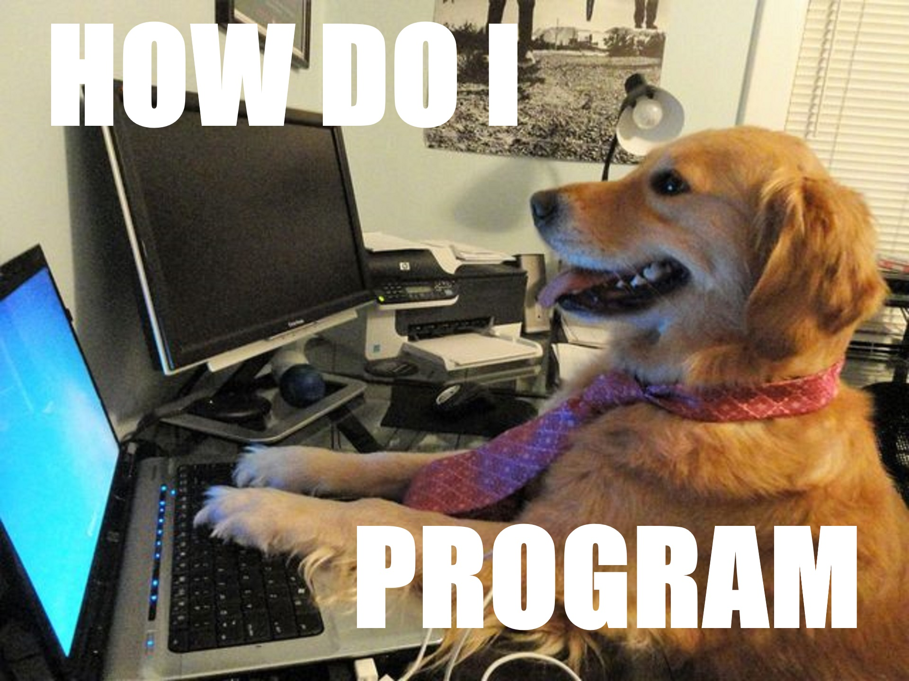

```{r setup, include=FALSE}
xaringanExtra::use_webcam()
xaringanExtra::use_tile_view()
xaringanExtra::use_tachyons()
xaringanExtra::use_extra_styles()
options(htmltools.dir.version = FALSE)
knitr::opts_chunk$set(fig.asp = .618,
                      fig.width = 6)
```
```{r xaringantheme, include = FALSE, warning = FALSE}
library(xaringanthemer)
#style_solarized_light(base_font_size = "22px")
style_mono_light(base_color = "#23395b",
                 base_font_size = "21px")
```
# Who are we?

.pull-left[
| Dr Matt Craddock |
|------------------------------|
|  |
|Sarah Swift Building Room 2226|
|mcraddock@lincoln.ac.uk       |
]
.pull-right[
| Dr Tochukwu Onwuegbusi |
|------------------------------|
|  |
|Sarah Swift Building Room 2211|
|tonwuegbusi@lincoln.ac.uk       |
]

---
class: center, middle, inverse
# Replicability and reproducibility 

---
background-image: url(images/01/headlines-repro.png)

---
background-image: url(images/01/F1.large.jpg)
background-size: contain

[Open Science Collaboration, 2015](dx.doi.org/10.1126/science.aac4716)

---

# Scenario A
.large[
You've just started work in a psychology lab. You're asked to help analyse some old data. There is reaction time data from 50 participants. Each participant's data is stored in a separate text file.

- How do you combine the data from each participant together to be able to analyse the data?

- It turns out some of the participants only completed part of the experiment - which ones, and what should you do with their data?

- What steps should you take to select and perform appropriate statistical analysis?
]

---

# Scenario B

.large[
You've been asked to design, implement, and evaluate a new treatment regime across several psychiatric institutes. Several colleagues are skeptical that it can deliver the kind of improvements in outcomes indicated in a publication describing the method.

- How do you interpret the strength of the previously published evidence?

- How do you design a rigorous test of the treatment efficacy?

- How do you evaluate and report on the outcomes of your trial?
]


---
# Research Methods and Skills

--
.pull-left[

]

--
.pull-right[

]

---
# Course outline
.pull-left[
### Weeks 1-5
- Introduction to R
- Basic R programming
- Plotting with ggplot2
- Data import, selection and manipulation
- Describing and summarising your data
]

.pull-right[
### Weeks 6-10
- Hypothesis testing and estimation
- *t*-tests and comparing two groups
- Correlation and linear regression
- One-way ANOVA
- Factorial ANOVA
]

### Weeks 11-13

- Qualitative methods

---
# Course outline

.pull-left[
### Weeks 1-5

]

.pull-right[
### Weeks 5, 7-10

]

---

# Course outline

.pull-left[
### Weeks 1-5

]

.pull-right[
### Weeks 5-10

]

---
# How it's going to work

.large[

Each week you'll be provided with a set of pre-recorded videos introducing the core topics for that week.

Most weeks you will be provided with some exercises to work on.

In timetabled sessions we will spend the first hour going over the week's exercises. In the second hour, you can spend the time working together on the exercises, and we'll be available to help out.

If you get stuck **ask us**!]

---
class: inverse, center, middle
# Introduction to R and RStudio

---
background-image: url(https://www.r-project.org/Rlogo.png)
background-position: 80% 10%

# What is R?
.large[
R is a statistical, mathematical programming language

* Created in 1993

* Designed from the ground up to support many statistical tasks

* Covers all aspects of data analysis from import through to production of reports

* Free, open source
    * Can be downloaded from the [R-project](https://r-project.org) website

* Continually evolving
    * R has over 12,000 *packages* that add additional functions
]

---
class: inverse, center, middle

# But WHY?

---
# What can you do with R?

.center[]
[Source: N. D. Phillips](https://ndphillips.github.io/IntroductionR_Course/presentations/Day_0_pres.html#4)
---
background-image: url(images/01/Rcompanies.png)
background-size: contain

---
background-image: url(images/01/spss_usage.png)

# Still not convinced?

---
class: inverse, center, middle

# Getting started

---
background-image: url(images/01/RStudio-logo.png)
background-size: 30%
background-position: 80% 5%
# What is RStudio?

.large[
- An **Integrated Development Environment (IDE)**

- An interface for R that makes your life much, much easier

- Makes many things explicit that you would otherwise have to guess
]


---
background-image: url(images/01/rstudiocloud_page.png)
background-size: 50%
background-position: 50% 90%

# Getting started TODAY
.large[
1. Open up a web browser

2. Go to https://rstudio.cloud

3. Sign up! Use your REAL NAME, and your University of Lincoln email address.
]

---
background-image: url(images/01/RStudioCloud.png)
background-size: contain
class: inverse

---
background-image: url(images/01/RStudioCloud_proj_circ.png)
background-size: contain
class: inverse

---
background-image: url(images/01/default_project.png)
background-size: contain
class: inverse

---
background-image: url(images/01/cloud-tools.png)
background-size: contain
class: inverse

---
background-image: url(images/01/cloud-appear.png)
background-size: contain
class: inverse

---
class: inverse, center, middle

# How it works!

---
background-image: url(images/01/proj_console.png)
background-size: contain
class: inverse

---
background-image: url(images/01/proj_console_repl.png)
background-size: contain
class: inverse

---

# How to use R

* The R Console

    * REPL: Read/Evaluate/Print/Loop
    
    * Type stuff in, it tries to do it

When you see the **>** symbol - 

```{r eval = FALSE}
*>
```

... R is waiting for your input.

```{r eval = FALSE}
> 5 
[1] 5
```

---

# Warming up

Try using R like a calculator!

### Basic arithmetic operators

```{r echo = FALSE}
knitr::kable(data.frame(Symbol = c("+",
                                   "-",
                                   "*",
                                   "/",
                                   "^",
                                   "%%"),
                        Operation = c("addition",
                                      "subtraction",
                                      "multiplication",
                                      "division",
                                      "exponentiation",
                                      "modulo")),
             format = "markdown")
```

---

# Warming up

You can break up long maths expressions over multiple lines:

```{r basic_calc}
2 + 4 + 5 + 
  5 + 6 + 7 + 8 +
  10
```

Note that when you do that, the ">" symbol changes to a "+"

```{r eval = FALSE}
> 5 +
*+ 5
[1] 10
```

---

# Remember!

.large[**>** means R is waiting for input.]

```{r eval = FALSE}
>
```

.large[**+** means R is waiting for you to finish your command.]

```{r eval = FALSE}
+
```

Either finish your command, or press the **Esc** key to cancel it.

---

# Text input

R can also accept text strings as input.

```{r eval = FALSE}
"hello world!"
[1] "hello world!"
```

You need to use quotation marks ("") to tell R that this is text:

```{r error = TRUE}
hello world!
```

Otherwise, you'll receive an error like the one above.

---
# Why is there an error?

In R, you can assign values to an **object** for subsequent use. **Objects** have names that are written as text.

The assignment operator is the two-character symbol:
```{r eval = FALSE}
*<-
```

You assign values to objects by putting the **<-** sign between the name of the object and the value you want to give it:

```{r}
example <- 5
example
```

Note that R does not immediately provide output when you assign the output to an object. 

---
# The assignment operator

.large[Think of **<-** as meaning "is now". i.e.

```{r}
example <- 5
```
can be read as 
```{r eval = FALSE}
The object "example" is now 5
```
]

---

# Working with objects

Once an object is assigned, the name that you gave it *stands in* for the *value* that you assigned to it, and can be used as if it were that value:

```{r}
example
example + 10 
example + 13 - 1 * 2 %% 4
```

---
background-image: url(images/01/cloud_environ.png)
background-size: contain
class: inverse

---
background-image: url(images/01/cloud_environ2.png)
background-size: contain
class: inverse

---
background-image: url(images/01/cloud-history.png)
background-size: contain
class: inverse

---
class: inverse, center, middle

# Try it out!

---
# Try a few things out!

1. Assign some values to objects using the assignment operator (**<-**)

2. Try using arithmetic operations (e.g. *, /, %%) on those objects

3. Try using arithmetic operations to combine multiple numerical objects

4. Try using arithmetic operations on text

---
# Combining multiple things

Sometimes you want to allocate more than one value to an object. You can use the **c()** function to do this.

```{r}
c(8, 5, 10)
example <- c(8, 5, 10)
example
```
```{r}
c("hello", "how", "are", "you")
```

## IMPORTANT: BRACKETS () AFTER A WORD MEAN THAT THIS IS A **FUNCTION** 

---
# Vectors

The function **c()** is creating **vectors**.

Vectors are simply a one-dimensional collection of things that all have the same *type* (we will cover data types next week!).

Note that mixing, for example, text and numbers, will yield a *character* vector.

```{r}
c(5, "five", 2)
```

---
# Functions

Functions are commands that operate on **objects**.

For example, to calculate the *mean* of several numbers, you can use the function **mean()**. The output of functions can also be assigned to **objects** using **<-**.

```{r}
mean(c(8, 5, 10))
example <- c(8, 5, 10)
mean(example)
example_mean <- mean(example)
example_mean
```

---
# Try it out!

1. Use **c()** to create a vector of numbers.

2. Use **c()** to create a vector of strings.

3. Calculate the **mean()** of a vector of numbers.

4. Try guessing some other simple statistics (e.g. other types of *average*) that you can use.

---
background-image: url(images/01/cloud-help.png)
background-size: 40%
background-position: 50% 75%
# Getting help 

If you don't know how to use a function, R has built-in help! 

There are several ways you can access it:

```{r eval = FALSE}
help("mean")
?mean
??mean
```

---
# Packages

Packages are the key to R's versatility. Over 12000 are currently available from the **Comprehensive R Archive Network** - [CRAN](https::https://cran.r-project.org/). The **install.packages()** function can be used to install packages.

Let's install the "cowsay" package. **cowsay** is an extraordinarily useful package, as you'll see.

One way to install the package is using the console:

```{r eval = FALSE}
install.packages("cowsay")
```

Once it's installed, use the **library()** function to load the package!

```{r eval = FALSE}
library(cowsay)
```

But **another** way to install is using the GUI!

---
background-image: url(images/01/cloud-packages.png)
background-size: contain
class: inverse

---
background-image: url(images/01/cloud-cowsay.png)
background-size: contain
class: inverse

---
background-image: url(images/01/cloud-help.png)
background-position: 90% 85%
background-size: 40%
# Try out the **cowsay** package

**cowsay** adds a function called **say()**. Load the function in as follows, and look at the help for **say()**.
```{r echo = FALSE}
library(cowsay)
```
```{r eval = FALSE}
library(cowsay)
?say()
```

.left-pull[
Remember that help appears in the bottom right window!

Look at **Usage** and **Arguments**

**Usage** is how to use the function.

**Arguments** are what the functions expect and understand.
]

---

```{r}
say(what = "Feed me, human.", by = "cat")
```

---
# Try out the say() function

1. Try a few different animals by changing the **by** argument

2. Change what the animals say by changing the **what** argument.

3. Assign the output to an object using the **<-** operator.

4. Print out the value that you assigned to the object.

---

# Additional resources

.pull-left[

]

.pull-right[

]

There are copies of both these books in the library.

R for Data Science is available freely online at http://r4ds.had.co.nz/

---
background-image:url(images/01/hopr-cover.png)
background-size: 25%
background-position: 85%, 25%
# An additional recommendation...

## Hands-on Programming with R 

Basic R programming book, also available for free online

https://rstudio-education.github.io/hopr/index.html

---
# This week's goals

1. Download [R](https://r-project.org) and RStudio! You'll find links and instructions on Blackboard.

2. Read through Chapter 1 of [R for Data Science](https://r4ds.had.co.nz/introduction.html)

3. Try out some of the introductory things mentioned in the slides, just to get a feel for using RStudio!
